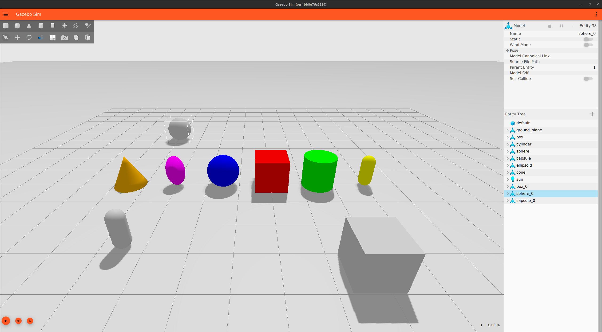
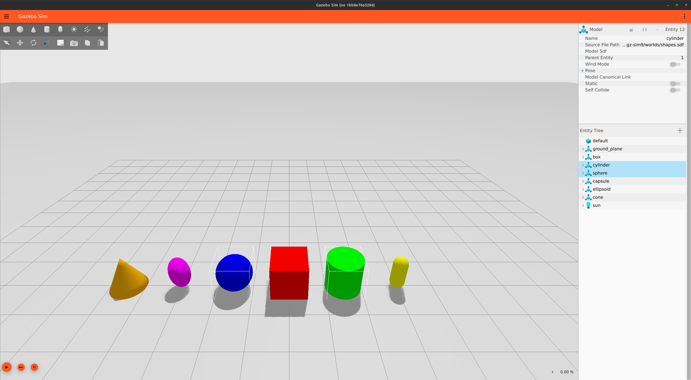
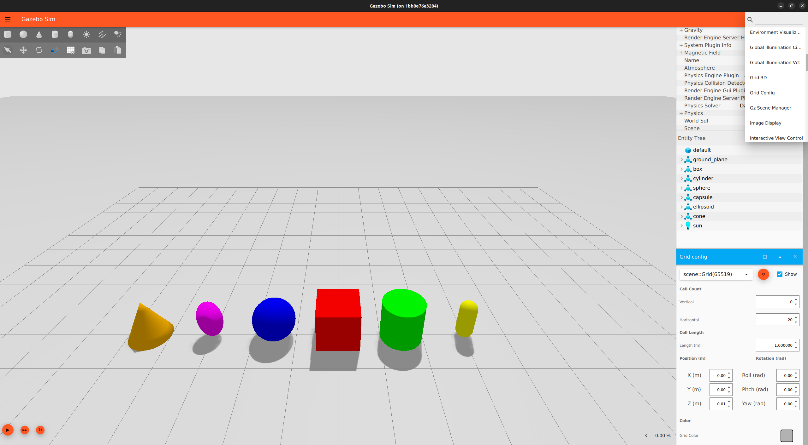

# GUI 이해하기

이 가이드는 Gazebo Graphical User Interface (GUI)에 대한 소개입니다.

## 사전 요구 사항

시작하기 전에 [Harmonic 설치](install)가 되어 있어야 합니다.
만약 [소스에서 설치](install)했다면
작업 공간을 [소스](install_ubuntu_src.md#using-the-workspace)해야 합니다.
그렇지 않다면 바로 시작할 수 있습니다!

샘플 월드로 Gazebo를 시작하고 실행해 보세요:

```bash
gz sim shapes.sdf
```

`gz sim`은 설치된 Gazebo의 최신 버전을 실행합니다.
`gz sim --versions`를 실행하여 Gazebo 버전이 두 개 이상 설치되어 있는지 확인할 수 있습니다.
예를 들어, Harmonic (8.x.x), Garden (7.x.x), Fortress (6.x.x)가 설치되어 있다면 `--versions`는 다음과 같이 반환할 수 있습니다:

```bash
8.0.0
7.0.0
6.0.0
```

Harmonic으로 작업하고 있는지 확인하려면 시작 시 `--force-version` 지시문을 포함하세요:

```bash
gz sim --force-version 8.0.0 shapes.sdf
```

## GUI

`shapes.sdf`를 실행하면 다음 화면이 표시됩니다:


인터페이스는 여러 섹션으로 구성됩니다:

### 툴바

GUI 상단의 툴바에는 왼쪽의 파일 메뉴 버튼()과 오른쪽의 플러그인 버튼() 두 개의 버튼이 있습니다.
파일 메뉴 버튼을 사용하면 월드를 파일로 저장하고, 인터페이스 구성을 저장 및 로드하며, 인터페이스 스타일 설정을 사용자 지정할 수 있습니다.
인터페이스 구성은 로드한 플러그인과 적용된 스타일 설정으로 구성됩니다.


파일 메뉴 버튼 아래에 있는 왼쪽 상단 툴바에는 모양 버튼(구, 상자, 원기둥, 캡슐, 타원체)과 조명 컨트롤(점 광원, 방향 광원, 스포트라이트)이 있습니다.
모양 버튼을 사용하면 상자, 구, 원기둥, 캡슐 또는 타원체 모델을 월드에 직접 삽입할 수 있습니다.
삽입하려는 모양을 클릭하고 월드에 배치하기만 하면 됩니다.
모양은 자동으로 지면 평면에 맞춰지고, 속성은 Entity Tree 플러그인 창에 표시됩니다.

다음 이미지는 세 가지 모양(`box_0`, `sphere_0`, `capsule_0`)을 추가한 후의 장면과 Entity Tree를 보여줍니다:



두 번째 줄의 첫 다섯 개 버튼은 `Transform Control`용입니다.
이 플러그인에 대해 자세히 알아보려면 [모델 조작하기](manipulating_models) 튜토리얼의 `Transform Control` 섹션으로 이동하세요.

플러그인 버튼은 사용 가능한 모든 플러그인을 나열합니다.
이 목록을 아래로 스크롤하여 사용 중인 Gazebo 버전에 사용 가능한 모든 플러그인을 볼 수 있습니다.
하나를 선택하면 해당 인터페이스가 오른쪽 패널에 나타납니다.

### 오른쪽 패널

GUI에는 시작 시 오른쪽 패널에 표시되는 두 개의 플러그인이 있습니다.
위쪽에는 Component Inspector가 있고 그 아래에는 Entity Tree가 있습니다.

시뮬레이션의 모든 것은 "엔티티"로 간주됩니다.
`shapes.sdf`에서 나열된 엔티티는 지면 평면, 각 모양 모델, 그리고 태양입니다.

Entity Tree의 엔티티는 확장하여 링크, 해당 시각적 요소 및 충돌 요소, 그리고 존재하는 경우 조인트를 표시할 수 있습니다.

Entity Tree에서 이름을 클릭하거나 장면에서 엔티티를 직접 클릭하여 시뮬레이션의 엔티티를 선택할 수 있습니다.
`Ctrl` 키를 누른 채 클릭하여 여러 개를 선택할 수도 있습니다.



플러그인을 마우스 오른쪽 버튼으로 클릭하여 기본 `Settings`를 열거나 `Close`할 수 있습니다.
플러그인 메뉴를 통해 플러그인을 (다시) 열 수 있습니다.

### 장면

장면 내에서 시뮬레이션된 월드 및 객체와 상호 작용하게 됩니다.

현재, 마우스를 사용하여 여러 가지 방법으로 장면을 탐색할 수 있습니다:

*   **왼쪽 클릭**: 엔티티 선택
*   **오른쪽 클릭**: 옵션 메뉴 열기:
    *   *Move to*: 엔티티를 기준으로 장면 중앙 정렬
    *   *Follow*: 엔티티가 움직이거나 주변을 패닝할 때 뷰가 계속 중앙에 맞춰질 엔티티 선택
    *   *Remove*: 시뮬레이션에서 엔티티 삭제
    *   *Copy*: 엔티티를 가상 클립보드에 복사
    *   *Paste*: 가상 클립보드에서 엔티티를 붙여넣어 복제본 생성
    *   *View*: 충돌, 질량 중심 등 엔티티의 시뮬레이션 측면을 시각화하는 다양한 옵션이 있는 하위 메뉴 열기
*   **왼쪽 클릭 및 드래그**: 장면 주변 패닝
*   **오른쪽 클릭 및 드래그**: 확대 및 축소
*   **스크롤 휠 앞/뒤**: 확대 및 축소
*   **스크롤 휠 클릭 및 드래그**: 장면 회전
    *   또는 **Shift 키 + 왼쪽 클릭 및 드래그** 사용

장면 내 엔티티와 상호 작용하는 더 복잡한 방법은 다음 튜토리얼에서 자세히 설명합니다.

#### Grid Config

장면의 그리드 가시성은 플러그인으로 조정할 수 있습니다.
셀 크기, 그리드 위치, 셀 수, 색상 등 월드 그리드의 기능을 조정할 수 있습니다.

툴바의 플러그인 버튼에서 Grid Config 플러그인을 선택하고 드롭다운 목록에서 선택하여 엽니다.
이제 플러그인이 오른쪽 패널에 표시됩니다 (Entity Tree 아래, 화면에 표시되지 않으면 아래로 스크롤).



#### World Control

장면 하단 가장자리를 따라 여러 버튼이 있습니다:


왼쪽에서 오른쪽으로 옵션은 `Play`, `Steps`, `Reset`, `RTF`(실시간 계수)입니다.

`Play`를 누르면 시뮬레이션이 시작됩니다.
동일한 버튼을 사용하여 시뮬레이션을 일시 중지할 수도 있습니다.

`Steps` 버튼을 사용하면 스텝 크기 또는 시뮬레이션 반복 속도로 시뮬레이션을 단계별로 실행할 수 있습니다.
버튼 위에 마우스를 올리면 스텝 크기를 사용자 지정할 수 있습니다.


`Reset`을 누르면 장면에 저장되지 않은 모든 수정 사항이 지워집니다. 클릭하면 새로 삽입된 모양 `box_0`, `sphere_0`, `capsule_0`이 제거됩니다.

장면의 가장 오른쪽 끝에서 `RTF`를 확장하여 실제 시간과 시뮬레이션 시간을 비교하는 백분율 값뿐만 아니라 해당 개별 값과 반복 횟수도 볼 수 있습니다.


World Control 옵션의 기능은 엔티티 조작을 시작하면 더 명확해질 것입니다.

## 다음 단계

이제 Gazebo GUI 탐색 및 용어에 익숙해졌으므로 [모델 조작하기](manipulating_models) 튜토리얼을 통해 더 의미 있는 모델 상호 작용에 대해 알아봅시다.