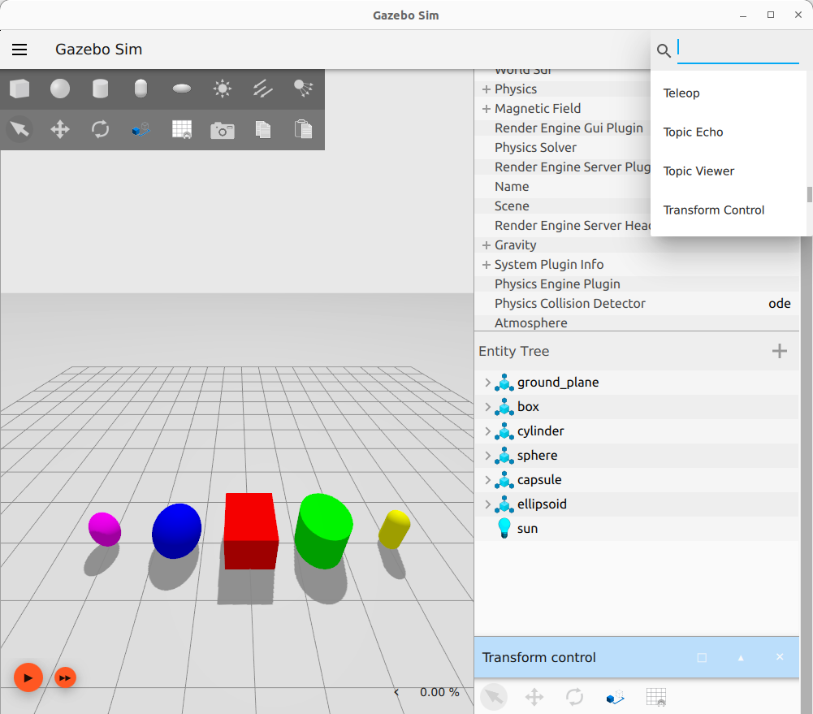
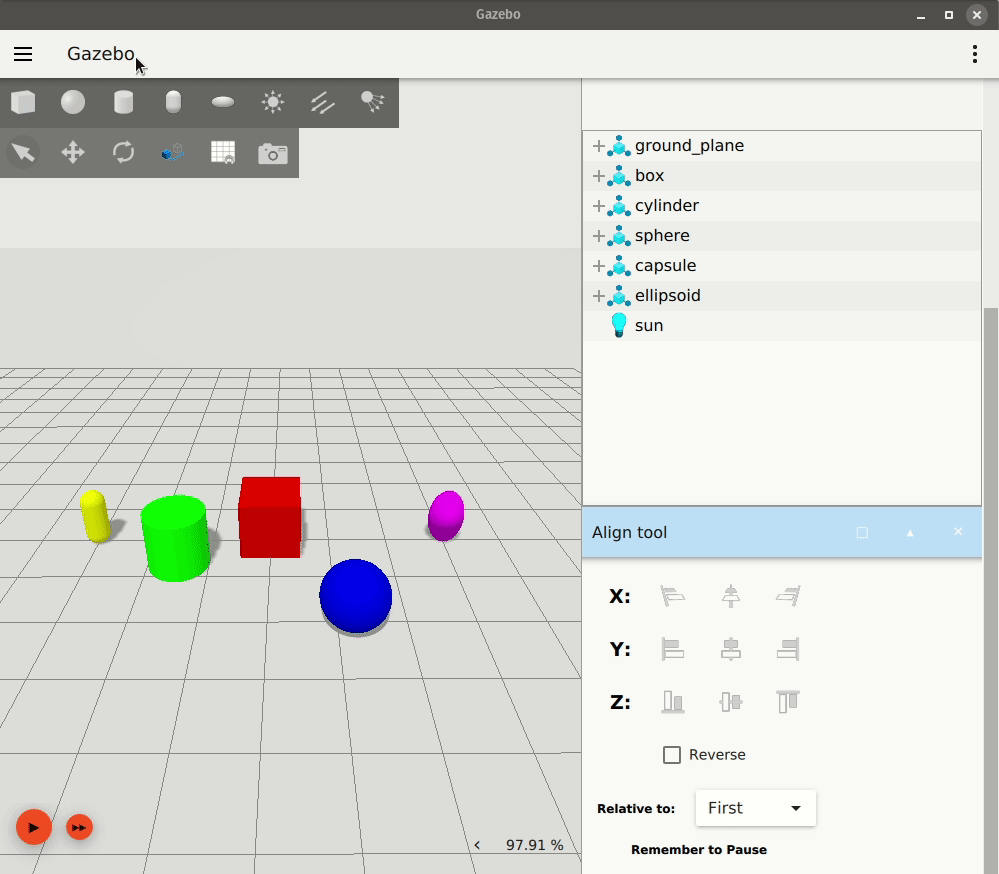

# Manipulating Models

이 튜토리얼에서는 Gazebo GUI에서 모델 및 장면 조작을 지원하는 다양한 플러그인 사용 방법을 안내합니다.

Transform Control plugin은 키 바인딩과 변환 제어 옵션(선택, 이동, 회전, 스냅)의 조합입니다.
이 [Gazebo's keyboard shortcuts](hotkeys) 차트는 이 튜토리얼에 도움이 될 수 있습니다.

View Angle plugin을 사용하면 시뮬레이션에서 엔티티를 마주보는 장면의 방향을 빠르고 쉽게 조정할 수 있습니다.

Component Inspector plugin은 다양한 객체 속성을 표시합니다.

Align Tool은 특정 엔티티의 경계 상자를 따라 또는 주변으로 엔티티를 정렬합니다.

## Prerequisites

먼저 샘플 월드를 사용하여 Gazebo를 시작하고 실행하십시오:

```bash
gz sim shapes.sdf
```

이전 튜토리얼인 [Understanding the GUI](gui)에서는 Gazebo GUI 탐색의 기본 사항을 설명합니다.

## Transform Control

왼쪽 상단 도구 모음에는 변형을 위한 컨트롤이 포함되어 있습니다.
또는, Transform Control plugin은 플러그인 드롭다운 메뉴에서 선택할 수 있습니다.
그러면 플러그인이 오른쪽 패널 하단에 나타납니다.



### Select Mode

선택이 기본 모드입니다.
장면에서 엔티티를 클릭하여 선택할 수 있습니다.
선택된 엔티티는 Entity Tree에서 강조 표시되어 선택되었음을 나타냅니다.
`Ctrl` 키를 누른 상태에서 클릭하여 여러 엔티티를 선택할 수 있습니다.


선택 모드에서는 엔티티를 조작할 수 없습니다.

다른 모드에서 `Esc` 키를 눌러 언제든지 선택 모드로 돌아갈 수 있습니다.

### Translate Mode

왼쪽 상단 도구 모음에서 왼쪽에서 두 번째 아이콘, Transform Control plugin을 클릭하거나 키보드 단축키 `T`를 눌러 이동 모드로 들어갑니다.


이동 모드를 사용하면 x, y, z 축을 따라 엔티티를 이동할 수 있습니다.

이동 모드에서 엔티티를 클릭하면 이동할 수 있는 축을 나타내는 화살표가 표시됩니다.
빨간색 화살표는 x축, 녹색은 y축, 파란색은 z축을 나타냅니다.
마우스를 움직이는 동안 화살표 중 하나를 클릭하고 누르고 있으면 해당 방향으로 엔티티가 이동합니다.


또한, `X`, `Y` 또는 `Z` 키 중 하나 또는 이들의 조합을 누른 상태에서 클릭하고 드래그하면 마우스를 움직이는 방향이나 선택한 축 화살표에 관계없이 해당 축을 따라 모델의 움직임이 제한됩니다.

### Rotate Mode

왼쪽 상단 도구 모음에서 왼쪽에서 세 번째 아이콘, Transform Control plugin을 클릭하거나 키보드 단축키 `R`을 눌러 회전 모드로 들어갑니다.


회전 모드를 사용하면 롤, 피치, 요 회전축을 중심으로 엔티티를 회전할 수 있습니다.

회전 모드에서 엔티티를 클릭하면 회전할 수 있는 축을 나타내는 원이 표시됩니다.
빨간색 원은 롤, 녹색은 피치, 파란색은 요를 나타냅니다.
마우스를 움직이는 동안 원 중 하나를 클릭하고 누르고 있으면 해당 축을 중심으로 엔티티가 회전합니다.


#### Align to World frame

엔티티의 로컬 축은 회전 후 World frame에서 정렬되지 않을 수 있습니다.
World frame 축을 따라 이동하려면 `Shift` 키를 누르십시오.

이것은 영구적인 재정렬이 아닙니다. `Shift` 키를 누르고 있는 동안 엔티티를 이동할 수 있지만, 키를 놓으면 로컬 이동 프레임으로 돌아갑니다.


엔티티의 로컬 회전 프레임에 대해서도 동일하게 수행할 수 있습니다.


### Enter Custom Snap Values

이동 또는 회전 시 `Ctrl` 키를 누른 상태에서 클릭하고 드래그하여 엔티티의 움직임을 미리 설정된 증분 값으로 "스냅"할 수 있습니다.
기본적으로 스냅 값은 이동의 경우 1미터, 회전의 경우 45°입니다.

이동 스냅은 World frame에 상대적으로 스냅되고, 회전 스냅은 객체의 현재 방향에 상대적으로 스냅됩니다.


왼쪽 상단 도구 모음 또는 Transform Control plugin에서 스냅 아이콘 을 클릭하여 스냅 값을 사용자 지정할 수 있습니다.


`Shift`와 `Ctrl`을 동시에 눌러 아직 정렬되지 않은 경우 World frame을 따라 모델을 스냅해 보십시오.

## Component Inspector

이 플러그인을 사용하면 엔티티를 선택하여 포즈, 바람의 작용 여부, 정적 여부 등 일부 속성을 표시할 수 있습니다.
또한 이 플러그인은 월드의 중력장 및 자기장을 표시합니다.

`Pose` 속성을 확장하면 선택한 객체의 좌표 값이 표시됩니다.
시뮬레이션이 실행되는 동안 객체가 이동(이동 또는 회전)되면 값이 업데이트됩니다.


또한 플러그인을 일시 중지하여 시뮬레이션이 재생되는 동안 객체의 포즈 값이 인스펙터에서 업데이트되지 않도록 할 수 있습니다.

또한, Component Inspector를 하나의 객체에 고정하여 다른 Component Inspector를 열어 다른 객체를 동시에 관찰할 수 있습니다.


## View Angle

플러그인 드롭다운 메뉴에서 View Angle을 선택합니다.

선택한 엔티티 또는 엔티티가 선택되지 않은 경우 World frame을 기준으로 장면을 볼 각도를 선택할 수 있습니다.
홈 버튼을 누르면 장면이 로드되었을 때의 원래 보기 포즈로 돌아갑니다.

각 보기 각도에서 동시에 여러 엔티티를 마주보도록 선택할 수도 있습니다.


## Align Tool

플러그인 드롭다운 메뉴에서 Align Tool을 선택합니다.

Align Tool은 다른 모델의 경계 상자 또는 링크와 같이 경계 상자가 있는 다른 엔티티를 따라 또는 주변으로 모델을 정렬합니다.
그러나 하위 링크나 최상위 모델 이외의 것은 정렬할 수 없습니다.

`Relative to First`가 선택된 상태에서 `Ctrl` + 클릭을 사용하여 두 모델을 선택하고 (선택 모드인지 확인) Align Tool
버튼 위로 마우스를 가져가면 두 번째 모델이 첫 번째 모델의 x, y 또는 z 축을 따라 정렬되는 미리보기를 볼 수 있습니다.
각 축의 버튼 위로 마우스를 가져가면 해당 축을 따라 정렬될 경우 모델이 최종적으로 위치할 위치의 미리보기가 표시되며, 클릭하면 해당
정렬이 확정됩니다.


Reverse 버튼은 모델 경계 상자의 외부 경계를 기준으로 정렬을 활성화합니다. 이 기능은 객체를 서로 정확히 옆에 배치하는 데 유용합니다. 아래 gif에서 Reverse 버튼을 눌렀을 때 정렬의 차이를 확인하십시오.



두 개 이상의 모델도 정렬할 수 있습니다. `Ctrl` + 클릭으로 더 많은 모델을 선택하기만 하면 됩니다. `Relative to:` 드롭다운 메뉴에서 `First` 또는 `Last`를 선택하여
정렬할 엔티티를 선택할 수 있습니다.

## Plot 3D

Plot 3D plugin을 사용하여 모델이 장면 내에서 움직일 때 모델의 3D 지점을 플로팅할 수 있습니다. 또한 3D 플롯을 생성하려는 모델을 고정할 수 있습니다.

이 플러그인을 사용하려면 플러그인 메뉴에서 Plot 3D를 선택하고, 장면에서 모델을 선택하고, Plot 3D plugin의 잠금 아이콘을 사용하여 모델을 잠그고, 장면에서 모델을 움직여 생성된 웨이포인트의 3D 플롯을 확인하십시오.


## Next Up

지금까지 Gazebo의 GUI에 대해 배우기 위해 기본 도형 모델과 상호 작용했습니다.
[Gazebo Fuel](https://app.gazebosim.org)에서 더 자세한 모델을 GUI로 가져오는 것도 가능합니다.
[Model Insertion from Fuel](fuel_insert) 튜토리얼에서 방법을 확인하십시오.