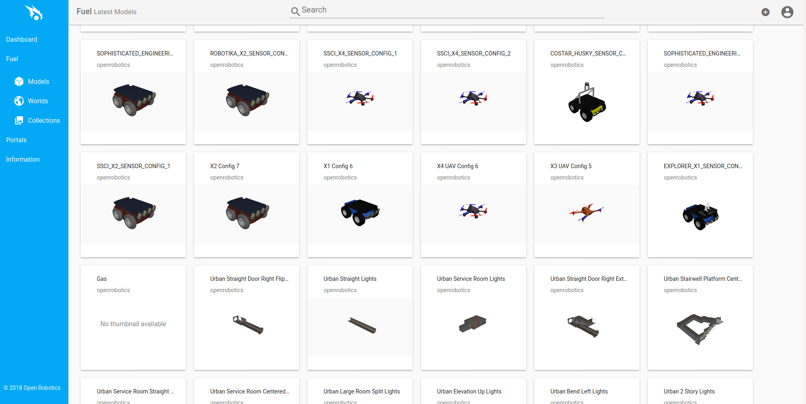
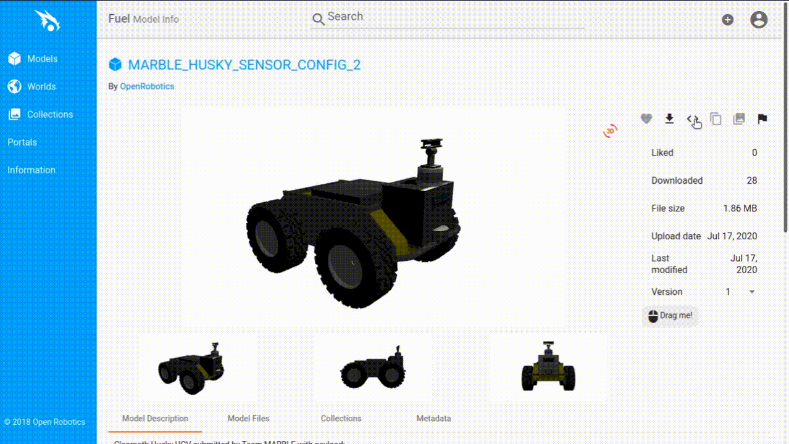

# Model Insertion from Fuel

Gazebo Fuel은 Gazebo GUI에서 실행 중인 월드에 쉽게 추가할 수 있는 수백 개의 모델을 호스팅합니다.

## Prerequisites

먼저 Gazebo를 빈 월드로 실행합니다:

```bash
gz sim empty.sdf
```

이전 튜토리얼인 [Manipulating Models](manipulating_models.md)에서는 모델과 상호 작용하는 방법을 보여주며, 이는 Fuel 모델을 월드에 추가한 후에 유용할 수 있습니다.

## Choose a Model

Fuel의 모델 컬렉션은 [app.gazebosim.org/fuel/models](https://app.gazebosim.org/fuel/models)에 있습니다.
해당 주소로 이동하여 사용 가능한 콘텐츠를 찾아보세요.



썸네일 중 하나를 클릭하거나 검색창을 사용하세요.
예를 들어, [Mine Cart Engine](https://app.gazebosim.org/OpenRobotics/fuel/models/Mine%20Cart%20Engine)을 찾아봅시다.


일부 모델 파일은 크기가 매우 커서 월드로 다운로드하는 데 시간이 걸릴 수 있습니다.
계속하기 전에 오른쪽에 있는 파일 크기가 사용자의 애플리케이션에 적합한지 확인하세요.

## Spawn a Model

시뮬레이션에 모델을 스폰하는 몇 가지 다른 방법이 있습니다.

1.  **Spawn from 'Fuel resources' using the Resource Spawner plugin.**

    플러그인 메뉴(오른쪽 상단 모서리)에서 Resource Spawner plugin을 선택합니다.
    플러그인은 오른쪽 패널에 나타나며, 플러그인을 보려면 아래로 스크롤해야 할 수 있습니다.
    'Fuel resources' 패널 아래에 리소스가 로드될 때까지 기다립니다.
    리소스 소유자(예: openrobotics)를 선택하면 이제 오른쪽 패널에서 모델 이름을 검색할 수 있습니다.
    클라우드 아이콘을 클릭하여 모델을 다운로드합니다.
    모델이 다운로드되면 모델을 클릭하여 시뮬레이션 장면에 삽입할 수 있습니다.

    

2.  **Download model files from Fuel and spawn from local sources using the Resource Spawner plugin.**

    -   [app.gazebosim.org/fuel/models](https://app.gazebosim.org/fuel/models)에서 모델 파일을 다운로드합니다.
    -   파일의 압축을 풀고 로컬 모델 디렉토리(예: `~/my-local-models/model-name`) 아래에 배치합니다.
    폴더에는 `materials`, `meshes`와 `model.config` 및 `model.sdf` 파일이 포함되어야 합니다.
    -   `export GZ_SIM_RESOURCE_PATH=~/my-local-models/`를 사용하여 모델 디렉토리를 리소스로 추가합니다.
    -   Gazebo Simulator를 열고 Resource Spawner Plugin을 추가하면 이제 모델이 로컬 리소스 아래에 표시됩니다.

    

3.  **Copying the SDF snippet and adding it to your custom world SDF file.**

    `< >` 버튼을 사용하면 SDF 스니펫을 직접 복사하여 월드 SDF 파일에 붙여넣을 수 있습니다.
    SDF 스니펫은 다음과 유사하게 보입니다:

    ```
    <include>
      <uri>
        https://fuel.gazebosim.org/1.0/OpenRobotics/models/Mine Cart Engine
      </uri>
    </include>
    ```

    그런 다음 아래 애니메이션과 같이 해당 스니펫을 월드 SDF 파일에 추가할 수 있습니다.
    자신만의 월드 SDF 파일을 빌드하는 방법에 대한 자세한 정보는 [SDF Worlds](sdf_worlds) 튜토리얼에서 찾을 수 있습니다.

    

4.  **Downloading the code to permanently add a Fuel model to your custom SDF file.**

    Fuel 모델을 `sdf` 파일에 영구적으로 추가하려면 모델 이미지 오른쪽에 있는 다운로드 화살표 아이콘을 클릭하여 코드를 쉽게 다운로드할 수 있습니다.
    사용자 정의 월드 SDF 파일을 구성하는 방법에 대한 자세한 내용은 [SDF Worlds](sdf_worlds) 튜토리얼을 참조하십시오.

이제 더 많은 모델을 추가하거나, 이전 튜토리얼의 도형과 동일한 방식으로 모델과 상호 작용하기 위해 배운 플러그인 중 하나를 로드할 수도 있습니다.

## Next Up

이제 Gazebo Fuel에서 호스팅되는 모델을 추가하는 방법을 알았으므로, [Build Your Own Robot](building_robot) 방법을 배울 차례입니다.