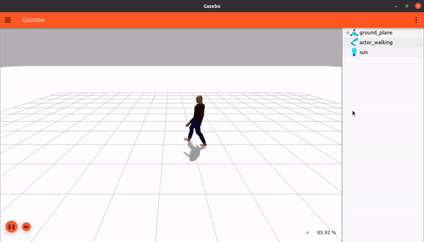
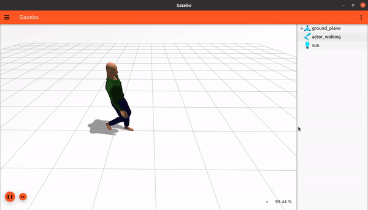

# Actors

이 튜토리얼에서는 우리 월드에 `actors`를 추가하는 방법과 스크립트 애니메이션을 만드는 방법을 배웁니다.
이 튜토리얼의 최종 월드는 [here](https://github.com/gazebosim/docs/blob/master/harmonic/tutorials/actors/actor_demo.sdf)에서 찾을 수 있습니다.

애니메이션은 물리 현상의 영향을 받지 않고 시뮬레이션에서 미리 정의된 경로를 따르는 엔티티를 만들고 싶을 때 매우 유용합니다. 이는 중력으로 인해 떨어지거나 다른 객체와 충돌하지 않는다는 것을 의미합니다. 그러나 RGB 카메라로 볼 수 있는 3D 시각화와 GPU 기반 센서로 감지할 수 있는 3D 메시를 갖게 됩니다. 이 튜토리얼은 시뮬레이션의 나머지 부분과 상호 작용하지 않는 개방 루프 궤적을 만드는 방법을 설명합니다.

## Actors

Gazebo Sim에서 애니메이션 모델은 `actor`라고 불립니다.

개별적으로 사용하거나 함께 결합하여 사용할 수 있는 두 가지 유형의 애니메이션이 있습니다:

* 스켈레톤 애니메이션: 한 모델 내 링크 간의 상대적인 움직임입니다:


* 궤적 애니메이션: 모든 `actor`의 링크를 하나의 그룹으로 궤적을 따라 월드 주위로 이동시킵니다:


* 결합된 경우: 월드에서 움직이는 스켈레톤 애니메이션을 구현합니다:



`Actors`는 다음과 같은 속성을 가집니다:

* 중력, 접촉 또는 기타 어떤 것으로부터든 힘이 적용되지 않습니다.
* `Actors`는 COLLADA (.dae) 및 BVH (.bvh) 파일에서 가져온 스켈레톤 애니메이션을 지원합니다.
* `Actors`는 SDF에서 직접 스크립트로 작성된 궤적을 가질 수 있습니다.

`<actor>` SDF 요소의 전체 사양은 [here](http://sdformat.org/spec?ver=1.8&elem=actor)에서 확인할 수 있습니다.

## Skeleton

Gazebo Sim은 두 가지 다른 스켈레톤 애니메이션 파일 형식인 COLLADA (.dae)와 Biovision Hierarchy (.bvh)를 지원합니다.

예를 들어, 아무 월드나 [empty.sdf](https://raw.githubusercontent.com/gazebosim/gz-sim/main/examples/worlds/empty.sdf) 월드를 열고 다음과 같이 `actor_walking`이라는 `actor`를 추가합니다.

```xml
<actor name="actor_walking">
    <skin>
        <filename>https://fuel.gazebosim.org/1.0/Mingfei/models/actor/tip/files/meshes/walk.dae</filename>
        <scale>1.0</scale>
    </skin>
    <animation name="walk">
        <filename>https://fuel.gazebosim.org/1.0/Mingfei/models/actor/tip/files/meshes/walk.dae</filename>
        <interpolate_x>true</interpolate_x>
    </animation>
</actor>
```

### Skin

`<skin>` 태그에서 우리 `actor`의 외형을 지정하는 COLLADA 파일 `walk.dae`를 로드했습니다. COLLADA 파일이 `<skin>` 태그 내에서 사용되면 해당 애니메이션이 로드됩니다. `<scale>`은 스킨의 크기를 조절합니다.

### Animation

`<animation>` 태그에서 `<filename>` 태그를 사용하여 우리 `actor`가 어떻게 움직일지 지정합니다. `<interpolate_x>`는 궤적을 따르는 동안 웨이포인트 내에서 애니메이션을 보간하는 데 사용됩니다. 이 값을 true로 설정하면 더 현실감 있고 부드러운 애니메이션이 가능합니다. 호환되는 스켈레톤이 있는 한 다양한 스킨과 다양한 애니메이션을 결합할 수 있습니다. 이제 월드를 실행하면 우리 모델이 움직이는 것을 볼 수 있습니다.



**참고**: [Gazebo Fuel](https://app.gazebosim.org/fuel)에서 많은 `actors`와 모델을 찾을 수 있습니다.

## Scripted trajectory

이것은 특정 시간에 도달해야 하는 일련의 포즈를 지정하는 것으로 구성된 `actors`의 상위 수준 애니메이션입니다. Gazebo Sim은 그 사이의 움직임을 보간하여 움직임이 유동적이도록 합니다.

`walk.dae`와 같이 X축 변위가 있는 애니메이션은 궤적을 따라가는 동안 스켈레톤이 애니메이션됩니다. 그러나 `talk_b.dae`와 같이 그렇지 않은 애니메이션의 경우 궤적이 있어도 스켈레톤이 움직이지 않습니다.

우리 `actor`가 지정된 궤적을 영원히 따르고 월드가 로드되자마자 재생을 시작하도록 다음과 같이 설정할 수 있습니다:

```xml
    <script>
        <loop>true</loop>
        <delay_start>0.000000</delay_start>
        <auto_start>true</auto_start>
```

스크립트는 `<actor>` `</actor>` 태그 사이에 정의됩니다.

`<script>` 태그 내부에는 다음 매개변수를 사용할 수 있습니다:

* `loop`: 스크립트를 루프로 반복하려면 이 값을 true로 설정합니다. 유동적인 연속 동작을 위해 마지막 웨이포인트가 첫 번째 웨이포인트와 일치하도록 합니다 (우리가 할 것처럼).

* `delay_start`: 스크립트를 시작하기 전에 대기할 시간(초)입니다. 루프로 실행 중인 경우 각 주기 시작 전에 이 시간만큼 대기합니다.

* `auto_start`: 시뮬레이션이 재생을 시작하자마자 애니메이션이 시작되어야 하는 경우 true로 설정합니다. 예를 들어 플러그인에 의해 트리거될 때만 애니메이션이 재생되어야 하는 경우 이 값을 false로 설정하는 것이 유용합니다.

궤적을 웨이포인트의 시퀀스로 정의해 봅시다:

```xml
        <trajectory id="0" type="walk" tension="0.6">
            <waypoint>
                <time>0</time>
                <pose>0 0 1.0 0 0 0</pose>
            </waypoint>
            <waypoint>
                <time>2</time>
                <pose>2.0 0 1.0 0 0 0</pose>
            </waypoint>
            <waypoint>
                <time>2.5</time>
                <pose>2 0 1.0 0 0 1.57</pose>
            </waypoint>
            <waypoint>
                <time>4</time>
                <pose>2 2 1.0 0 0 1.57</pose>
            </waypoint>
            <waypoint>
                <time>4.5</time>
                <pose>2 2 1.0 0 0 3.142</pose>
            </waypoint>
            <waypoint>
                <time>6</time>
                <pose>0 2 1 0 0 3.142</pose>
            </waypoint>
            <waypoint>
                <time>6.5</time>
                <pose>0 2 1 0 0 -1.57</pose>
            </waypoint>
            <waypoint>
                <time>8</time>
                <pose>0 0 1.0 0 0 -1.57</pose>
            </waypoint>
            <waypoint>
                <time>8.5</time>
                <pose>0 0 1.0 0 0 0</pose>
            </waypoint>
        </trajectory>
    </script>
```

`<trajectory>` 태그 내에서 우리 `actor`가 따를 일련의 웨이포인트를 정의합니다. `<trajectory>`에는 `id`, `type`, `tension`의 세 가지 속성이 있습니다. `type`은 `<animation>` 태그의 `name` 속성에 지정된 값과 동일한 이름을 가져야 합니다. 따라서 이 경우 `walk`로 지정됩니다. `tension` 매개변수는 궤적이 주어진 웨이포인트에 얼마나 가깝게 달라붙을지를 제어하는 데 사용됩니다. 기본 `tension` 값은 0이며, 이는 Catmull-Rom 스플라인에 해당하며 애니메이션이 웨이포인트를 벗어날 수 있습니다. `tension` 값이 1이면 애니메이션이 웨이포인트에 고정됩니다. `tension` 값은 0에서 1 사이여야 합니다.

`trajectory` 태그 아래에 다음을 정의합니다:

* `waypoint`: 궤적에는 여러 개의 웨이포인트가 있을 수 있습니다. 각 웨이포인트는 시간과 포즈로 구성됩니다:
    * `time`: 스크립트 시작부터 계산하여 포즈에 도달해야 하는 시간(초)입니다.
    * `pose`: 초기 `actor` 포즈에 대해 도달해야 하는 포즈입니다.

월드를 실행하면 우리 `actor`가 웨이포인트를 따라 사각형으로 움직이는 것을 볼 수 있습니다.


**참고 사항**:

* 웨이포인트가 정의되는 순서는 중요하지 않으며, 주어진 시간을 따릅니다.
* 궤적은 전체적으로 부드럽게 처리됩니다. 이는 유동적인 움직임을 얻을 수 있지만 웨이포인트에 포함된 정확한 포즈에는 도달하지 못할 수도 있음을 의미합니다.

이제 여러분 차례입니다! 다양한 궤적 설명을 시도해 보세요.

## Video walk-through

이 튜토리얼의 비디오 연습은 저희 YouTube 채널에서 볼 수 있습니다: [Gazebo tutorials: Animated human actors](https://youtu.be/1VZexw67a2o)

<iframe width="560" height="315" src="https://www.youtube.com/embed/1VZexw67a2o" frameborder="0" allow="accelerometer; autoplay; encrypted-media; gyroscope; picture-in-picture" allowfullscreen></iframe>