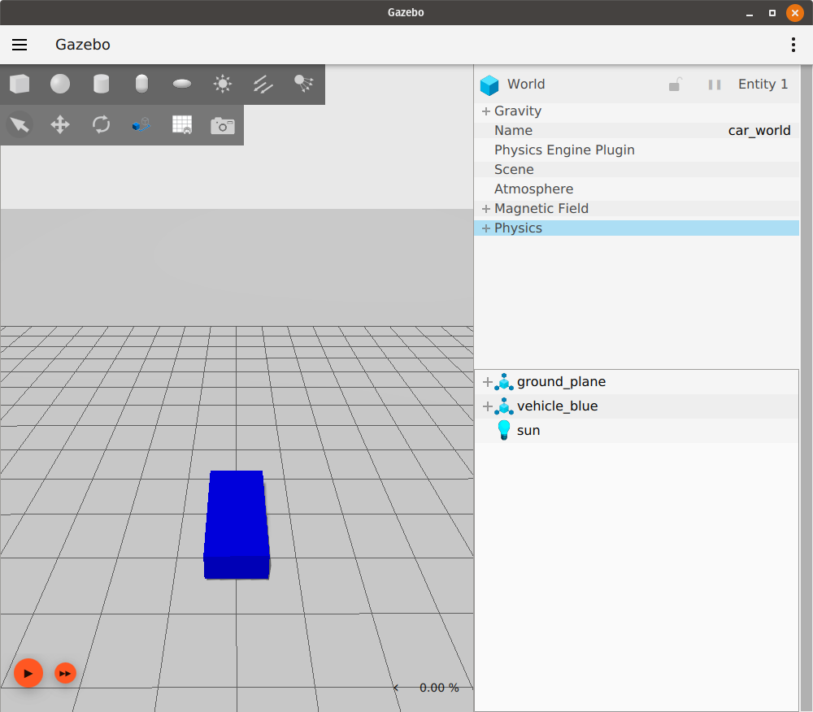
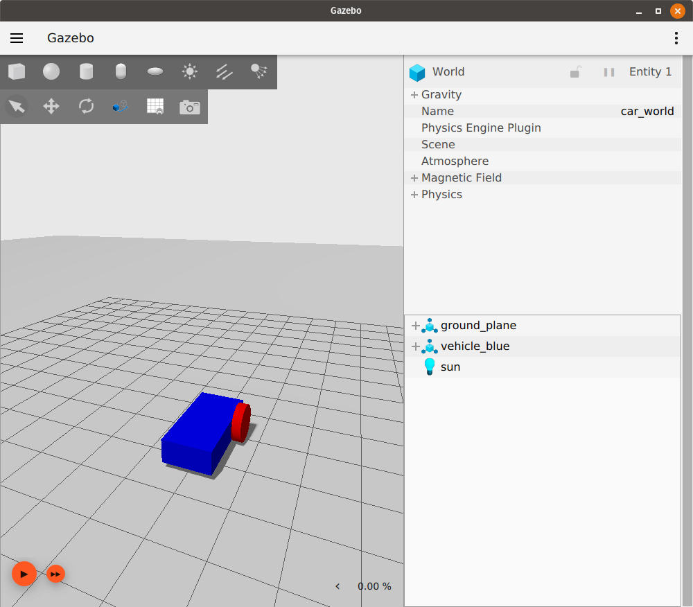

# Building your own robot

이 튜토리얼에서는 SDFormat에서 우리만의 로봇을 만드는 방법을 배웁니다. 간단한 이륜 로봇을 만들 것입니다.

이 튜토리얼의 완성된 SDF 파일은 [here](https://github.com/gazebosim/docs/blob/master/harmonic/tutorials/building_robot/building_robot.sdf)에서 찾을 수 있습니다.

## What is SDF

[SDFormat](http://sdformat.org/) (Simulation Description Format), 때때로 SDF로 약칭되며, 로봇 시뮬레이터, 시각화 및 제어를 위한 객체와 환경을 설명하는 XML 형식입니다.

## Building a world

간단한 월드를 만드는 것으로 시작하여 그 안에 우리 로봇을 만들 것입니다. `building_robot.sdf`라는 새 파일을 열고 다음 코드를 복사하십시오.

```xml
<?xml version="1.0" ?>
<sdf version="1.10">
    <world name="car_world">
        <physics name="1ms" type="ignored">
            <max_step_size>0.001</max_step_size>
            <real_time_factor>1.0</real_time_factor>
        </physics>
        <plugin
            filename="gz-sim-physics-system"
            name="gz::sim::systems::Physics">
        </plugin>
        <plugin
            filename="gz-sim-user-commands-system"
            name="gz::sim::systems::UserCommands">
        </plugin>
        <plugin
            filename="gz-sim-scene-broadcaster-system"
            name="gz::sim::systems::SceneBroadcaster">
        </plugin>

        <light type="directional" name="sun">
            <cast_shadows>true</cast_shadows>
            <pose>0 0 10 0 0 0</pose>
            <diffuse>0.8 0.8 0.8 1</diffuse>
            <specular>0.2 0.2 0.2 1</specular>
            <attenuation>
                <range>1000</range>
                <constant>0.9</constant>
                <linear>0.01</linear>
                <quadratic>0.001</quadratic>
            </attenuation>
            <direction>-0.5 0.1 -0.9</direction>
        </light>

        <model name="ground_plane">
            <static>true</static>
            <link name="link">
                <collision name="collision">
                <geometry>
                    <plane>
                    <normal>0 0 1</normal>
                    </plane>
                </geometry>
                </collision>
                <visual name="visual">
                <geometry>
                    <plane>
                    <normal>0 0 1</normal>
                    <size>100 100</size>
                    </plane>
                </geometry>
                <material>
                    <ambient>0.8 0.8 0.8 1</ambient>
                    <diffuse>0.8 0.8 0.8 1</diffuse>
                    <specular>0.8 0.8 0.8 1</specular>
                </material>
                </visual>
            </link>
        </model>
    </world>
</sdf>
```

파일을 저장하고, 파일을 저장한 디렉토리로 이동한 다음 시뮬레이터를 실행하십시오:

`gz sim building_robot.sdf`

**참고**: 파일 이름을 원하는 대로 지정하고 컴퓨터의 아무 곳에나 저장할 수 있습니다.

지면과 태양광만 있는 빈 월드가 보일 것입니다. 자신만의 월드를 만드는 방법을 배우려면 [World demo](sdf_worlds)를 확인하십시오.

## Building a model

`</model>` 태그 아래에 다음과 같이 로봇 모델을 추가할 것입니다:

### Defining the model

```xml
<model name='vehicle_blue' canonical_link='chassis'>
    <pose relative_to='world'>0 0 0 0 0 0</pose>
```

여기서는 우리 모델의 이름 `vehicle_blue`를 정의합니다. 이 이름은 동일 수준의 다른 태그나 모델(형제 요소) 사이에서 고유해야 합니다.
각 모델은 `canonical_link`로 지정된 하나의 링크를 가질 수 있으며, 모델의 암시적 프레임은 이 링크에 부착됩니다. 정의되지 않은 경우 첫 번째 `<link>`가 `canonical_link`로 선택됩니다.
`<pose>` 태그는 우리 모델의 위치와 방향을 정의하는 데 사용되며, `relative_to` 속성은 다른 프레임에 대한 모델의 포즈를 정의하는 데 사용됩니다.
`relative_to`가 정의되지 않으면 모델의 `<pose>`는 월드를 기준으로 합니다.

우리의 포즈를 `world`에 상대적으로 설정해 봅시다. 포즈 태그 안의 값은 다음과 같습니다: `<pose>X Y Z R P Y</pose>`, 여기서 `X Y Z`는 프레임의 위치를 나타내고 `R P Y`는 롤, 피치, 요(roll, pitch, yaw)에서의 방향을 나타냅니다.
두 프레임(모델과 월드)이 동일하도록 이 값들을 0으로 설정합니다.

## Links forming our robot

모든 모델은 `joints`로 함께 연결된 `links`(단일 링크일 수도 있음) 그룹입니다.

### Chassis

```xml
    <link name='chassis'>
        <pose relative_to='__model__'>0.5 0 0.4 0 0 0</pose>
```

자동차의 첫 번째 링크인 `chassis`와 `model`에 대한 상대 포즈를 정의합니다.

#### Inertial properties

```xml
    <inertial> <!--inertial properties of the link mass, inertia matix-->
        <mass>1.14395</mass>
        <inertia>
            <ixx>0.095329</ixx>
            <ixy>0</ixy>
            <ixz>0</ixz>
            <iyy>0.381317</iyy>
            <iyz>0</iyz>
            <izz>0.476646</izz>
        </inertia>
    </inertial>
```

여기서는 `<mass>` 및 `<inertia>` 행렬과 같은 `chassis`의 관성 속성을 정의합니다. 기본 도형에 대한 관성 행렬 값은 이 [tool](https://amesweb.info/inertia/mass-moment-of-inertia-calculator.aspx)을 사용하여 계산할 수 있습니다.

#### Visual and collision

```xml
    <visual name='visual'>
        <geometry>
            <box>
                <size>2.0 1.0 0.5</size>
            </box>
        </geometry>
        <!--let's add color to our link-->
        <material>
            <ambient>0.0 0.0 1.0 1</ambient>
            <diffuse>0.0 0.0 1.0 1</diffuse>
            <specular>0.0 0.0 1.0 1</specular>
        </material>
    </visual>
```

이름에서 알 수 있듯이 `<visual>` 태그는 링크의 모양을 담당합니다.
`<geometry>` 태그 안에 링크의 모양을 `<box>` (육면체)로 정의한 다음, `<size>` 태그 안에 이 상자의 세 가지 치수(미터 단위)를 지정합니다.
그런 다음 `<material>` 태그 안에 링크의 재질을 정의합니다.
여기서는 `<ambient>`, `<diffuse>`, `<specular>` 색상을 각각 [0, 1] 범위의 네 숫자(빨강/녹색/파랑/알파) 세트로 정의했습니다.

```xml
        <collision name='collision'>
            <geometry>
                <box>
                    <size>2.0 1.0 0.5</size>
                </box>
            </geometry>
        </collision>
    </link>
</model>
```

`<collision>` 태그는 링크의 충돌 속성, 즉 링크가 다른 객체와 어떻게 반응하고 물리 엔진의 영향을 어떻게 받을지를 정의합니다.

**참고**: `<collision>`은 시각적 속성과 다를 수 있습니다. 예를 들어, 계산 시간을 줄이기 위해 더 간단한 충돌 모델이 종종 사용됩니다.

위의 모든 부분을 순서대로 월드 파일에 복사한 후 월드를 다시 실행하십시오:

`gz sim building_robot.sdf`

우리 모델은 다음과 같아야 합니다:



왼쪽 상단 도구 모음에서 이동(Translate) 아이콘을 클릭한 다음 모델을 선택하십시오.
다음과 같이 세 개의 축이 보여야 합니다:


이것들은 우리 모델의 축이며, 빨간색은 x축, 녹색은 y축, 파란색은 z축입니다.

### Left wheel

로봇에 바퀴를 추가해 봅시다. 다음 코드는 `</link>` 태그 뒤와 `</model>` 태그 앞에 들어갑니다. 동일한 모델에 속하는 모든 링크와 조인트는 `</model>` 앞에 정의되어야 합니다.

```xml
<link name='left_wheel'>
    <pose relative_to="chassis">-0.5 0.6 0 -1.5707 0 0</pose>
    <inertial>
        <mass>1</mass>
        <inertia>
            <ixx>0.043333</ixx>
            <ixy>0</ixy>
            <ixz>0</ixz>
            <iyy>0.043333</iyy>
            <iyz>0</iyz>
            <izz>0.08</izz>
        </inertia>
    </inertial>
```

링크 이름 `left_wheel`을 정의한 다음 `chassis` 링크에 대한 `<pose>` `relative_to`를 정의했습니다.
바퀴는 `chassis` 뒤쪽 왼쪽에 배치되어야 했기 때문에 `pose` 값을 `-0.5 0.6 0`으로 선택했습니다.
또한, 우리 바퀴는 실린더이지만 옆으로 누워 있습니다.
그래서 방향 값을 `-1.5707 0 0`으로 정의했는데, 이는 x축을 중심으로 -90도 회전한 것입니다(각도는 라디안 단위).
그런 다음 바퀴의 `inertial` 속성, 즉 `mass`와 `inertia` 행렬을 정의했습니다.

#### Visualization and Collision

```xml
    <visual name='visual'>
        <geometry>
            <cylinder>
                <radius>0.4</radius>
                <length>0.2</length>
            </cylinder>
        </geometry>
        <material>
            <ambient>1.0 0.0 0.0 1</ambient>
            <diffuse>1.0 0.0 0.0 1</diffuse>
            <specular>1.0 0.0 0.0 1</specular>
        </material>
    </visual>
    <collision name='collision'>
        <geometry>
            <cylinder>
                <radius>0.4</radius>
                <length>0.2</length>
            </cylinder>
        </geometry>
    </collision>
</link>
```

`<visual>` 및 `<collision>` 속성은 이전 링크와 유사하지만, 링크의 모양이 `<cylinder>` 형태이며 실린더의 `<radius>`와 `<length>`라는 두 가지 속성이 필요하다는 점이 다릅니다.
파일을 저장하고 월드를 다시 실행하면 우리 모델은 다음과 같아야 합니다:



### Right wheel

```xml
<!--The same as left wheel but with different position-->
<link name='right_wheel'>
    <pose relative_to="chassis">-0.5 -0.6 0 -1.5707 0 0</pose> <!--angles are in radian-->
    <inertial>
        <mass>1</mass>
        <inertia>
            <ixx>0.043333</ixx>
            <ixy>0</ixy>
            <ixz>0</ixz>
            <iyy>0.043333</iyy>
            <iyz>0</iyz>
            <izz>0.08</izz>
        </inertia>
    </inertial>
    <visual name='visual'>
        <geometry>
            <cylinder>
                <radius>0.4</radius>
                <length>0.2</length>
            </cylinder>
        </geometry>
        <material>
            <ambient>1.0 0.0 0.0 1</ambient>
            <diffuse>1.0 0.0 0.0 1</diffuse>
            <specular>1.0 0.0 0.0 1</specular>
        </material>
    </visual>
    <collision name='collision'>
        <geometry>
            <cylinder>
                <radius>0.4</radius>
                <length>0.2</length>
            </cylinder>
        </geometry>
    </collision>
</link>
```

오른쪽 바퀴는 위치를 제외하고 왼쪽 바퀴와 유사합니다.

### Defining an arbitrary frame

SDF 1.7부터 (Fortress는 SDF 1.8 사용) 임의의 프레임을 정의할 수 있습니다. 다음 두 가지 속성을 가집니다:

* `name`: 프레임의 이름
* `attached_to`: 이 프레임이 부착된 프레임 또는 링크의 이름입니다.

캐스터 바퀴를 위한 프레임을 다음과 같이 추가해 봅시다:

```xml
<frame name="caster_frame" attached_to='chassis'>
    <pose>0.8 0 -0.2 0 0 0</pose>
</frame>
```

프레임 이름을 `caster_frame`으로 지정하고 `chassis` 링크에 부착한 다음, `<pose>` 태그를 사용하여 프레임의 위치와 방향을 정의했습니다.
`relative_to` 속성을 사용하지 않았으므로 포즈는 `attached_to` 속성에 명명된 프레임, 이 경우 `chassis`를 기준으로 합니다.

### Caster wheel

```xml
<!--caster wheel-->
<link name='caster'>
    <pose relative_to='caster_frame'/>
    <inertial>
        <mass>1</mass>
        <inertia>
            <ixx>0.016</ixx>
            <ixy>0</ixy>
            <ixz>0</ixz>
            <iyy>0.016</iyy>
            <iyz>0</iyz>
            <izz>0.016</izz>
        </inertia>
    </inertial>
    <visual name='visual'>
        <geometry>
            <sphere>
                <radius>0.2</radius>
            </sphere>
        </geometry>
        <material>
            <ambient>0.0 1 0.0 1</ambient>
            <diffuse>0.0 1 0.0 1</diffuse>
            <specular>0.0 1 0.0 1</specular>
        </material>
    </visual>
    <collision name='collision'>
        <geometry>
            <sphere>
                <radius>0.2</radius>
            </sphere>
        </geometry>
    </collision>
</link>
```

마지막 링크는 `caster`이며, 그 포즈는 위에서 정의한 `caster_frame` 프레임을 기준으로 합니다.
보시다시피 위치나 방향을 정의하지 않고 `pose` 태그를 닫았습니다. 이 경우 링크의 포즈는 `relative_to`에 있는 프레임과 동일(항등)합니다.

`<visual>` 및 `<collision>` 태그에서 구의 `<radius>`를 필요로 하는 다른 모양 `<sphere>`를 정의했습니다.

### Connecting links together (joints)

이 링크들을 함께 연결해야 합니다. 여기서 `<joint>` 태그의 역할이 중요해집니다.
조인트 태그는 두 링크를 함께 연결하고 서로에 대해 어떻게 움직일지를 정의합니다.
`<joint>` 태그 안에는 연결할 두 링크와 그 관계(움직임 방식)를 정의해야 합니다.

#### Left wheel joint

```xml
<joint name='left_wheel_joint' type='revolute'>
    <pose relative_to='left_wheel'/>
```

첫 번째 조인트는 `left_wheel_joint`입니다.
이름 `name='left_wheel_joint'`와 유형 `type='revolute'`라는 두 가지 속성을 가집니다.
`revolute` 유형은 조인트 제한이 있는 1 회전 자유도를 제공합니다.
조인트의 포즈는 자식 링크 프레임, 즉 `left_wheel` 프레임과 동일합니다.

```xml
    <parent>chassis</parent>
    <child>left_wheel</child>
```

모든 조인트는 두 개의 링크(바디)를 함께 연결합니다.
여기서는 `chassis`를 `left_wheel`과 연결합니다.
`chassis`는 부모 링크이고 `left_wheel`은 자식 링크입니다.

```xml
    <axis>
        <xyz expressed_in='__model__'>0 1 0</xyz> <!--can be defined as any frame or even arbitrary frames-->
        <limit>
            <lower>-1.79769e+308</lower>    <!--negative infinity-->
            <upper>1.79769e+308</upper>     <!--positive infinity-->
        </limit>
    </axis>
</joint>
```

여기서는 회전축을 정의합니다.
회전축은 `parent` 또는 `child` 링크뿐만 아니라 어떤 프레임이든 될 수 있습니다.
`model` 프레임에 대한 y축을 선택했으므로 y 요소에 `1`을 넣고 다른 요소에는 0을 넣었습니다.
회전 조인트의 경우 `<lower>` 및 `<upper>` 태그에서 회전 각도의 `<limits>`를 정의해야 합니다.

**참고**: 각도는 라디안 단위입니다.

#### Right wheel joint

`right_wheel_joint`는 조인트의 포즈를 제외하고 매우 유사합니다.
이 조인트는 `right_wheel`을 `chassis`와 연결합니다.

```xml
<joint name='right_wheel_joint' type='revolute'>
    <pose relative_to='right_wheel'/>
    <parent>chassis</parent>
    <child>right_wheel</child>
    <axis>
        <xyz expressed_in='__model__'>0 1 0</xyz>
        <limit>
            <lower>-1.79769e+308</lower>    <!--negative infinity-->
            <upper>1.79769e+308</upper>     <!--positive infinity-->
        </limit>
    </axis>
</joint>
```

#### Caster wheel joint

캐스터에는 다른 유형의 조인트(연결)가 필요합니다.
3 회전 자유도를 제공하는 `type='ball'`을 사용했습니다.

```xml
<joint name='caster_wheel' type='ball'>
    <parent>chassis</parent>
    <child>caster</child>
</joint>
```

## Conclusion

월드를 실행하십시오:

`gz sim building_robot.sdf`

다음과 같아야 합니다:


만세! 첫 번째 로봇을 만들었습니다. SDFormat 태그에 대한 자세한 내용은 [here](http://sdformat.org/spec)에서 확인할 수 있습니다. 다음 [tutorial](moving_robot)에서는 로봇을 움직이는 방법을 배웁니다.

## Video walk-through

이 튜토리얼의 비디오 연습은 저희 YouTube 채널에서 볼 수 있습니다: [Gazebo tutorials: Building a robot](https://youtu.be/Z-gjU0KAjiw).

<iframe width="560" height="315" src="https://www.youtube.com/embed/Z-gjU0KAjiw" frameborder="0" allow="accelerometer; autoplay; encrypted-media; gyroscope; picture-in-picture" allowfullscreen></iframe>