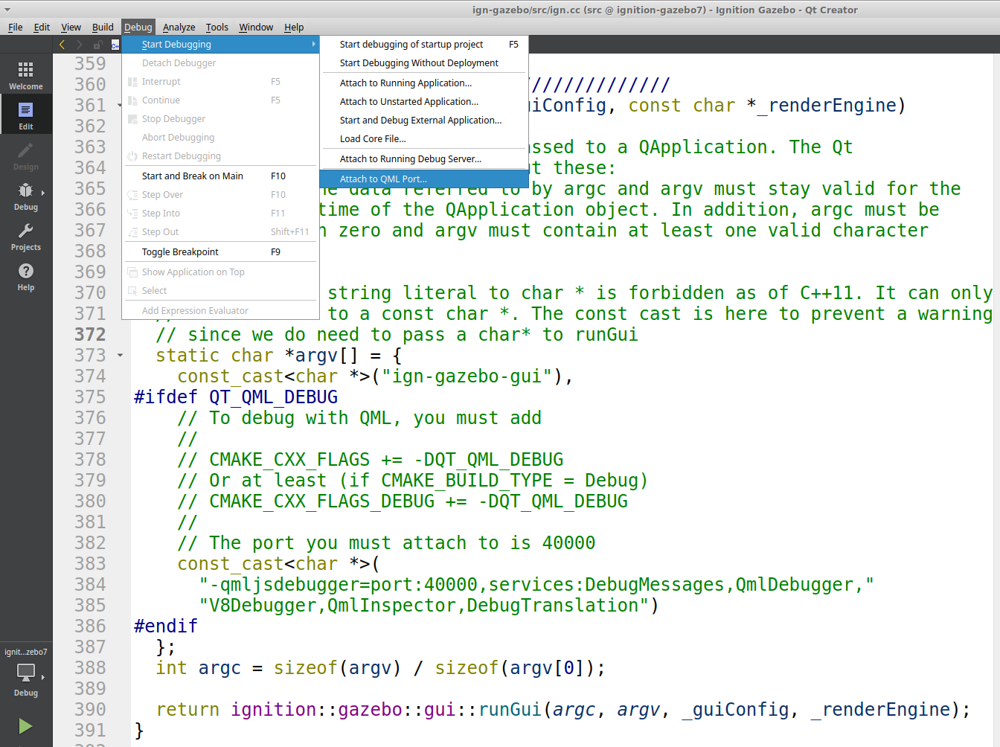

# Source Installation on Ubuntu

이 지침은 Ubuntu Jammy (22.04) 및 Ubuntu Noble (24.04)에 적용됩니다.

## Install tools

소스 컴파일을 돕기 위해 몇 가지 추가 도구를 사용하는 것이 권장되지만, 소스를 올바르게 가져오고 빌드하는 다른 방법도 가능합니다.

모든 라이브러리의 소스를 가장 쉽게 얻는 방법은 [vcstool](https://github.com/dirk-thomas/vcstool)을 사용하는 것입니다.

모든 다양한 라이브러리와 gz-sim을 올바른 순서로 컴파일하려면 [colcon](https://colcon.readthedocs.io/en/released/)이 권장됩니다.
colcon 도구는 pip (또는 pip가 실패할 경우 pip3)를 사용하여 모든 플랫폼에서 사용할 수 있습니다.

일부 도구는 Python 3.5 (또는 그 이상)를 필요로 하며, 이는 일부 플랫폼(예: Ubuntu Focal)에서 기본 옵션이 아닙니다. Python
[virtualenv](https://virtualenv.pypa.io/en/latest/)는 기본 옵션을 쉽게 변경할 수 없는 경우 유용한 해결책이 될 수 있습니다.

## Generic tools

이 튜토리얼에 필요한 도구를 설치합니다:

```bash
sudo apt install python3-pip python3-venv lsb-release gnupg curl git
```

## vcstool and colcon from pip

PIP는 모든 플랫폼에서 사용할 수 있습니다. PIP 작업 공간을 사용하여 도구를 설치합니다:

```bash
python3 -m venv $HOME/vcs_colcon_installation
. $HOME/vcs_colcon_installation/bin/activate
pip3 install vcstool colcon-common-extensions
```

`vcs`와 `colcon`은 이제 현재 터미널의 PIP 작업 공간에서 사용할 수 있습니다. 다른 터미널에서 사용하려면 위에서 수행한 것처럼 `activate` 스크립트를 실행하십시오.

## vcstool and colcon from apt

다른 방법은 Debian 또는 Ubuntu에서 사용 가능한 `.deb` 패키지를 사용하는 것입니다:

```bash
sudo sh -c 'echo "deb http://packages.ros.org/ros2/ubuntu $(lsb_release -sc) main" > /etc/apt/sources.list.d/ros2-latest.list'
curl -s https://raw.githubusercontent.com/ros/rosdistro/master/ros.asc | sudo apt-key add -
sudo apt-get update
sudo apt-get install python3-vcstool python3-colcon-common-extensions
```

## Getting the sources

아래 지침은 디렉토리 관리를 위해 일부 UNIX 명령을 사용하지만, Windows에서의 동등한 대안도 동일한 결과를 제공해야 합니다.

첫 번째 단계는 `vcstool`과 `colcon`이 작동할 수 있는 개발자 작업 공간을 만드는 것입니다:

```bash
mkdir -p ~/workspace/src
cd ~/workspace/src
```

gazebo-harmonic의 모든 소스는 yaml 파일에 선언되어 있습니다. 작업 공간으로 다운로드합니다:

```bash
curl -O https://raw.githubusercontent.com/gazebo-tooling/gazebodistro/master/collection-harmonic.yaml
```

`vcstool`을 사용하여 해당 저장소에서 모든 Gazebo 라이브러리 소스를 자동으로 가져옵니다:

```bash
vcs import < collection-harmonic.yaml
```

src 하위 디렉토리에는 빌드 준비가 된 모든 소스가 포함되어야 합니다.

## Install dependencies

컴파일하기 전에 Harmonic 컬렉션을 구성하는 다양한 패키지의 모든 종속성을 설치해야 합니다. 모든 플랫폼에는 소프트웨어 종속성을 설치하는 다른 방법이 있습니다.

`packages.osrfoundation.org`를 apt 소스 목록에 추가합니다:

```bash
sudo curl https://packages.osrfoundation.org/gazebo.gpg --output /usr/share/keyrings/pkgs-osrf-archive-keyring.gpg
echo "deb [arch=$(dpkg --print-architecture) signed-by=/usr/share/keyrings/pkgs-osrf-archive-keyring.gpg] http://packages.osrfoundation.org/gazebo/ubuntu-stable $(lsb_release -cs) main" | sudo tee /etc/apt/sources.list.d/gazebo-stable.list > /dev/null
sudo apt-get update
```

아래 명령은 Gazebo 소스 코드가 있는 작업 공간에서 실행해야 하며 Ubuntu에 모든 종속성을 설치합니다:

```bash
cd ~/workspace/src
sudo apt -y install \
  $(sort -u $(find . -iname 'packages-'`lsb_release -cs`'.apt' -o -iname 'packages.apt' | grep -v '/\.git/') | sed '/gz\|sdf/d' | tr '\n' ' ')
```

## Building the Gazebo Libraries

컴파일러와 모든 소스가 준비되면 컴파일할 차례입니다. 작업 공간으로 변경하고 `colcon`에 의해 인식되는 패키지를 나열하여 절차를 시작합니다:

```bash
cd ~/workspace/
colcon graph
```

`colcon graph`는 [interdependency diagram](https://colcon.readthedocs.io/en/released/reference/verb/graph.html#example-output)과 함께 Gazebo 라이브러리를 나열해야 합니다. 그렇다면 전체 라이브러리 세트를 빌드할 준비가 된 것입니다:

:::{warning}

컴파일에는 최대 16GB의 RAM 메모리가 필요할 수 있습니다. 필요한 경우 컴파일 스레드 수를 줄이려면 해당 지침에 자세히 설명된 대로 colcon과 함께 MAKEFLAGS를 사용하십시오.

:::


```bash
colcon build --merge-install
```

빌드 프로세스 속도를 높이려면 다음을 사용하여 테스트를 비활성화할 수도 있습니다.

```bash
colcon build --cmake-args ' -DBUILD_TESTING=OFF' --merge-install
```

디버거를 사용하려면 디버그 심볼을 활성화하십시오. Gazebo는 느리게 실행되지만 GDB를 사용할 수 있습니다:

```bash
colcon build --cmake-args ' -DBUILD_TESTING=OFF' ' -DCMAKE_BUILD_TYPE=Debug' --merge-install
```

특정 패키지와 모든 종속 패키지를 빌드하려면:

```bash
colcon build --merge-install --packages-up-to PACKAGE_NAME
```

단일 패키지를 빌드하려면:

```bash
colcon build --packages-select PACKAGE_NAME
```

더 많은 `colcon` 빌드 및 테스트 옵션을 보려면 [colcon documentation](https://colcon.readthedocs.io/en/released/#)을 방문하십시오.

오류가 없으면 모든 바이너리를 사용할 준비가 된 것입니다. 오류는 [Troubleshooting](troubleshooting.md#ubuntu) 섹션에서 확인할 수 있습니다.

## Using the workspace

새 터미널을 사용할 때마다 작업 공간을 소싱해야 합니다.

bash에서 작업 공간을 소싱하려면 다음 명령을 실행하십시오:

```bash
. ~/workspace/install/setup.bash
```

또는 zsh에서:

```zsh
. ~/workspace/install/setup.zsh
```

이것으로 소스 설치 지침이 끝났습니다. Gazebo 사용을 시작하려면 [Getting started](getstarted) 페이지로 돌아가십시오!

## Uninstalling source-based install

소스 기반 설치는 원하는 결과에 따라 여러 가지 방법을 사용하여 "제거"할 수 있습니다:

  1. 위 지침에 따라 `colcon`으로 작업 공간을 설치한 경우, "제거"는 새 터미널을 열고 작업 공간의 `setup.sh`를 소싱하지 않는 것만으로 충분할 수 있습니다. 이렇게 하면 사용자의 환경은 시스템에 Gazebo가 설치되지 않은 것처럼 작동합니다.

  2. 라이브러리를 사용하지 않으려는 것 외에도 공간을 확보하려는 경우 다음 명령으로 전체 작업 공간 디렉토리를 삭제할 수 있습니다:

     ```bash
     rm -rf ~/workspace
     ```

  3. 소스 코드를 유지하려면 원하는 대로 `install` / `build` / `log` 디렉토리를 제거하고 `src` 디렉토리는 남겨둘 수 있습니다.

## Troubleshooting

[Troubleshooting](troubleshooting.md#ubuntu)를 참조하십시오.

## QML Debugging

QML 디버깅을 수행하려면 다음이 필요합니다:

 - colcon에 `--cmake-args -DDQT_QML_DEBUG` 플래그 추가
 - QtCreator

다음과 같이 Gazebo를 빌드해야 합니다:

```bash
colcon build --cmake-args ' -DQT_QML_DEBUG' --merge-install
```

> **참고:** 고급 사용자는 `gz-sim` 프로젝트에만 이 플래그가 필요하다는 점에 유의할 수 있습니다.

이 작업이 완료된 후 `gz sim -g`를 실행하면 다음 메시지가 표시됩니다:

```
QML debugging is enabled. Only use this in a safe environment.
QML Debugger: Waiting for connection on port 40000...
```

그 후 `QtCreator -> Debug -> Start Debugging -> Attach to QML Port...`로 이동하여 QML 포트를 입력하면 됩니다.



거기를 클릭한 후 포트 번호를 40000으로 설정하고 확인을 누릅니다.


QtCreator 통합을 개선하여 별도의 설정 없이 바로 작동하도록 노력하고 있습니다.

ruby `gz` 스크립트는 아직 애플리케이션에 필요한 명령줄 인수를 전달하지 않습니다.

모든 인스턴스가 포트 40000을 사용하려고 하기 때문에 하나의 인스턴스만 사용할 수 있다는 점에 유의하십시오. 프로세스를 종료하고 너무 빨리 즉시 다시 시작하면 OS가 여전히 포트가 사용 중이라고 주장할 수 있으므로 두 번째 (재)실행은 QML 디버거 연결 요청을 수신하지 않습니다.

### Avoid QML stall waiting for debugger on startup

개발 중에 QtCreator가 QML 디버깅 포트에 연결될 때까지 `gz sim -g`가 실제로 시작되지 않아 불편할 수 있습니다.

이것이 문제라면 C++ 파일 `gz-sim/src/gz.cc`를 편집하고 여기서 `block`을 제거할 수 있습니다. 예:

```c++
// The following:
const_cast<char *>(
      "-qmljsdebugger=port:40000,block,services:DebugMessages,QmlDebugger,"
      "V8Debugger,QmlInspector,DebugTranslation")

// Must become the following
const_cast<char *>(
      "-qmljsdebugger=port:40000,services:DebugMessages,QmlDebugger,"
      "V8Debugger,QmlInspector,DebugTranslation")
```