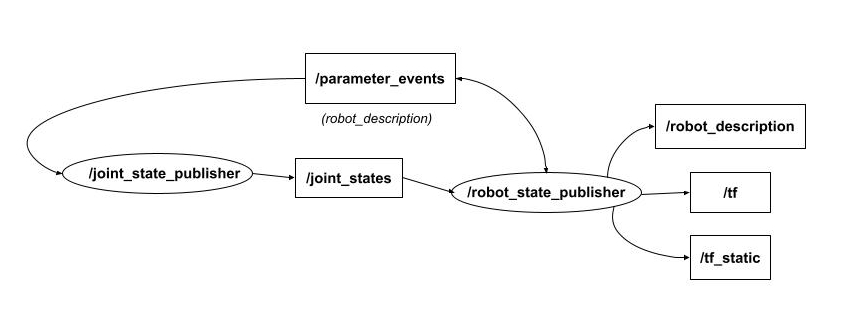
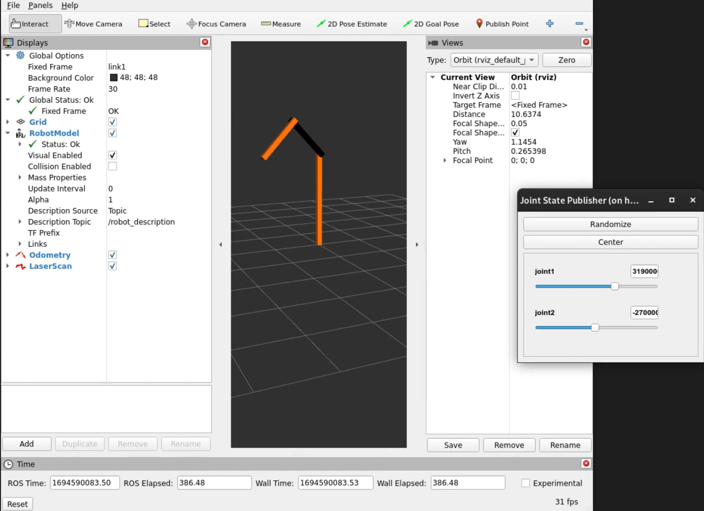

# ROS 2 Interoperability

`rrbot`은 회전 관절을 가진 간단한 2링크 로봇 팔이며, 이 튜토리얼은 ROS 2와 Gazebo Sim의 상호 운용성을 보여주기 위해 이를 사용하는 예시입니다.

## Overview
로봇과 상호 작용하기 위해 ROS 2의 통신 및 제어 메커니즘을 활용할 것입니다. Gazebo는 `rrbot` 로봇 팔의 현실적인 물리 시뮬레이션과 시각화를 제공하는 시뮬레이션 환경으로 사용됩니다.
로봇 모델은 로봇의 구조, 관절, 링크 및 해당 속성을 정의하는 [SDFormat](http://sdformat.org/) (Simulation Description Format)을 사용하여 설명됩니다.
Gazebo의 물리 엔진은 로봇의 동역학을 시뮬레이션하는 반면, ROS 2의 시각화 도구인 [RViz](https://github.com/ros2/rviz)는 제어 노드에서 게시한 데이터를 기반으로 로봇 모델과 그 움직임을 표시하며, 모두 동일한 로봇 설명 파일을 사용합니다.
사용자는 ROS 2 명령을 통해 `rrbot`과 상호 작용하여 로봇의 팔을 움직이거나 관절 상태 정보를 검색할 수 있습니다.

## Prerequisites

1.  계속 진행하려면 ROS 2 및 Gazebo가 제대로 설치되어 있어야 합니다. [Install Gazebo and ROS document](ros_installation)을 따르십시오.
2.  ROS 개념 및 터미널 명령에 대한 기본적인 이해.
3.  이 튜토리얼을 시작하기 전에 [`ros_gz_bridge`](https://github.com/gazebosim/ros_gz)에 익숙해지려면 [ROS 2 Integration](ros2_integration)을 확인하십시오.

## Setup

새로운 ROS 2 Python launch 파일을 시작하거나 프로젝트의 기본 launch 파일에 다음 노드를 추가하십시오. 목표는 다음과 같습니다.
1.  로봇 모델 개발 및 테스트 설정
2.  Gazebo 월드에서 시뮬레이션된 로봇 모델을 제어하도록 RViz (및 기타 ROS 2 도구) 구성

참고: 이 튜토리얼의 전체 소스 코드는 [ros_gz_example_bringup package](https://github.com/gazebosim/ros_gz_project_template/tree/main/ros_gz_example_bringup/launch) launch 파일에서 찾을 수 있습니다.

## Implementation

### Load robot description to the parameter server

로봇 설명 파일을 로드하여 파라미터 서버에 `robot_description` 파라미터를 설정합니다.

```python
    sdf_file = os.path.join(pkg_project_description, 'models', 'rrbot', 'model.sdf')
    with open(sdf_file, 'r') as infp:
        robot_desc = infp.read()
```

### Launch state publisher nodes

로봇 포즈를 게시하고 제어하려면 로봇의 관절 상태가 필요합니다.



1.  [`joint_state_publisher`](https://github.com/ros/joint_state_publisher)는 파라미터 서버에서 `robot_description` 파라미터를 읽고 고정되지 않은 모든 관절을 찾아 해당 관절이 모두 정의된 [JointState](https://docs.ros.org/en/api/sensor_msgs/html/msg/JointState.html) 메시지를 게시합니다.
    ```python
    joint_state_publisher_gui = Node(
        package='joint_state_publisher_gui',
        executable='joint_state_publisher_gui',
        name='joint_state_publisher_gui',
        arguments=[sdf_file],
        output=['screen']
    )
    ```
2.  RViz에서 시각화하고 `joint_state_publisher_gui`의 도움으로 슬라이더를 사용하여 관절 상태와 포즈를 조정하여 로봇 모델을 구성합니다.

    

    노드 API에 대한 [documentation](http://docs.ros.org/en/jazzy/p/joint_state_publisher_gui/)을 참조하십시오.
    이 기능은 모델의 초기 개발 중에 유용합니다.
    이 시점에서 [Setup](#setup)에 정의된 첫 번째 목표를 달성했습니다.

3.  이제 이를 확장하여 로봇 모션을 시각화하려면 위치와 변환이 필요합니다.
    [`robot_state_publisher`](https://github.com/ros/robot_state_publisher)는 로봇의 설명과 관절 각도를 입력으로 받아 로봇의 운동학적 트리 모델을 사용하여 로봇 링크의 3D 포즈를 게시합니다.
    ```python
    robot_state_publisher = Node(
        package='robot_state_publisher',
        executable='robot_state_publisher',
        name='robot_state_publisher',
        output='both',
        parameters=[
            {'use_sim_time': True},
            {'robot_description': robot_desc},
        ]
    )
    ```
    이러한 3D 포즈는 로봇의 모션을 추적/계획하거나, 로봇의 다른 부분 간에 통신하거나, 로봇의 성능을 평가하는 데 유용한 `/tf` 토픽에 게시됩니다.

### Configure a communication bridge

이러한 관절 상태는 이전에 본 것처럼 `joint_state_publisher`에서 가져오거나 시뮬레이션된 [JointStatePub](https://gazebosim.org/api/sim/8/classgz_1_1sim_1_1systems_1_1JointStatePublisher.html) 시스템의 `joint_state` 메시지에서 가져올 수 있습니다.

노드 설정에서 리매핑을 추가하거나 [bridge.yaml](https://github.com/gazebosim/ros_gz_project_template/blob/main/ros_gz_example_bringup/config/ros_gz_example_bridge.yaml)을 생성하여 ROS 토픽 `/joint_states`와 Gazebo 토픽 `/world/demo/model/diff_drive/joint_state` 간의 브리지를 구성합니다:

```bash
- ros_topic_name: "/joint_states"
  gz_topic_name: "/world/demo/model/diff_drive/joint_state"
  ros_type_name: "sensor_msgs/msg/JointState"
  gz_type_name: "gz.msgs.Model"
  direction: GZ_TO_ROS
```

브리지에 대한 자세한 내용은 [ROS 2 Integration](ros2_integration)에서 알아보십시오.

### Maintaining a single robot description format

기존 시뮬레이션 자산을 ROS 2 도구와 함께 사용하는 주요 문제점은 URDF 파일을 Gazebo에서 읽을 수 있는 형식으로 업데이트하는 것이었습니다. 이는 더 이상 필요하지 않습니다. 프로젝트에서 URDF 및 SDF 파일을 유지 관리하는 경우 이제 URDF를 삭제하고 ROS와 Gazebo 모두에 대해 SDF만 사용할 수 있습니다.

이는 SDF 파일을 URDF C++ DOM 구조로 변환하여 ROS 2 에코시스템에서 이해할 수 있도록 하는 파서 플러그인 라이브러리인 `sdformat_urdf`에 의해 가능해졌습니다.
그러나 플러그인에는 몇 가지 제한 사항이 있으며, 예를 들어 모든 SDFormat 태그가 호환되는 것은 아닙니다. 예를 들어 관절에 센서가 연결되어 있으면 구문 분석되지 않습니다. 자세한 내용은 [here](https://github.com/ros/sdformat_urdf/tree/jazzy/sdformat_urdf)를 참조하십시오.

이 기능을 포함하려면 SDFormat 파일을 `/robot_description` ROS 토픽에 인쇄하기만 하면 되며, 내부적으로 ROS는 이 경우 `sdformat_urdf`와 같은 적절한 파서를 찾아 파일을 읽습니다. 이는 이전에 `robot_state_publisher`를 구성하는 동안 이미 수행되었습니다.

### Run RViz and Gazebo

[Setup](#setup)에서 정의된 두 번째 목표는 본질적으로 Gazebo로 직접 제어할 수 있는 단일 로봇 설명 형식을 유지하는 것입니다.
로봇의 SDFormat XML 설명을 사용하여 시뮬레이터는 모델 관절 상태를 게시합니다.
그리고 `robot_state_publisher`는 이러한 관절 상태를 RViz 및 기타 ROS 도구에서 사용하는 `tf`로 변환하는 작업을 처리합니다.
이를 통해 Gazebo에서 시뮬레이션된 모델을 RViz에서 시각화할 수 있습니다.


## Conclusion

기존 ROS 및 Gazebo 프로젝트를 향상시키기 위해 이 기능을 구성하십시오.
`ros_gz_project_template`은 필요한 디렉토리, 빌드 파일 및 실행 스크립트를 포함하여 ROS 2 및 Gazebo 프로젝트를 위한 체계적인 구조를 제공합니다.
템플릿 사용에 대한 지침은 [Getting Started with `ros_gz_project_template` for ROS 2 and Gazebo Development](ros_gz_project_template_guide)를 참조하십시오.