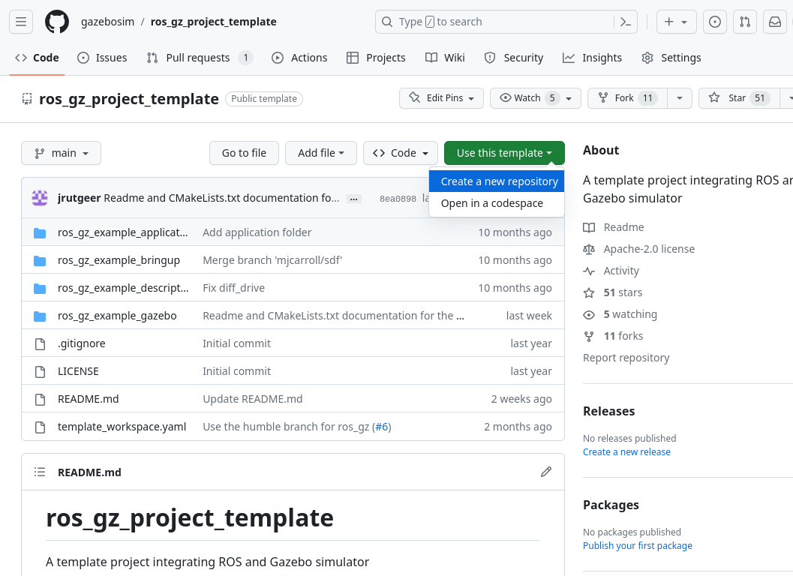

# ROS 2 및 Gazebo 개발을 위한 `ros_gz_project_template` 가이드

이 가이드에서는 `ros_gz_project_template`를 사용하여 ROS 2 및 Gazebo 프로젝트를 위한 (권장) 구조화된 작업 공간을 생성하거나 기존 작업 공간을 개선하는 방법을 배웁니다. 이 템플릿은 일관된 레이아웃, 자동화된 빌드 프로세스, ROS 2 및 Gazebo와의 통합을 제공하여 로봇 애플리케이션 개발에 집중할 수 있도록 합니다.

## Installation Steps

1. 프로젝트를 시작하는 경우 새 작업 공간을 생성하거나 기존 프로젝트의 소스 디렉토리로 이동하십시오:

   ```bash
   mkdir -p ~/project_ws/src
   cd ~/project_ws/src
   ```

2. 직접 [`ros_gz_project_template` template](https://github.com/gazebosim/ros_gz_project_template)를 사용하고 GitHub에서 프로젝트 저장소를 생성하십시오.

   

   또는 템플릿 저장소를 복제하여 시작하십시오:

   ```bash
   wget https://raw.githubusercontent.com/gazebosim/ros_gz_project_template/main/template_workspace.yaml
   vcs import < template_workspace.yaml
   ```

3. 복제된 저장소 폴더의 이름을 원하는 프로젝트 이름으로 변경하십시오:

   ```bash
   mv ros_gz_project_template your_project_name
   ```

## Package structure

이 시점에서 프로젝트에 다음 패키지가 포함됩니다:

* `ros_gz_example_application` - ROS 2 관련 코드 및 구성을 보유합니다. 즉, 제어, 계획 또는 모든 고급 알고리즘이 있는 곳입니다.

   <pre> ├── CMakeLists.txt
   ├── package.xml
   ├── <span style="color:#12488B"><b>src</b></span>
       └── ...
   </pre>

* `ros_gz_example_bringup` - 실행 파일 및 고급 유틸리티, ROS와 Gazebo 간의 통신 브리지를 보유합니다. 모든 로봇 또는 하드웨어 관련 구성은 여기에 포함됩니다.

   <pre> ├── <span style="color:#12488B"><b>config</b></span>
   │   ├── ros_gz_example_bridge.yaml
   │   └── diff_drive.rviz
   ├── <span style="color:#12488B"><b>launch</b></span>
       └── diff_drive.launch.py
   </pre>

* `ros_gz_example_description` - 시뮬레이션된 시스템의 SDF 설명 및 기타 [simulation assets](#accessing-simulation-assets)를 보유합니다.

   <pre> ├── <span style="color:#12488B"><b>hooks</b></span>
   │   └── ros_gz_example_description.dsv.in
   ├── <span style="color:#12488B"><b>models</b></span>
       ├── <span style="color:#12488B"><b>diff_drive</b></span>
           ├── model.config
           └── model.sdf
   </pre>

* `ros_gz_example_gazebo` - Gazebo 관련 코드 및 구성을 보유합니다. 즉, 사용자 정의 월드 및 사용자 지정 시스템 플러그인이 최종적으로 위치하는 곳입니다.

   <pre> ├── <span style="color:#12488B"><b>include</b></span>
   │   └── <span style="color:#12488B"><b>ros_gz_example_gazebo</b></span>
   │       ├── BasicSystem.hh
   │       └── FullSystem.hh
   ├── <span style="color:#12488B"><b>src</b></span>
   │   ├── BasicSystem.cc
   │   └── FullSystem.cc
   ├── <span style="color:#12488B"><b>worlds</b></span>
           └── diff_drive.sdf
   </pre>

## Accessing Simulation Assets

Simulation assets에는 URDF 또는 SDF 형식의 모델 또는 로봇 설명, 로봇의 다양한 부분을 시각화하는 데 도움이 되는 메시 및 재질 파일, 그리고 마지막으로 이러한 모든 요소를 시뮬레이션된 월드 SDF로 컴파일하는 것이 포함됩니다. Gazebo는 이러한 자산을 찾는 몇 가지 다른 메커니즘을 제공하며, `GZ_SIM_RESOURCE_PATH` 환경 변수에서 검색을 초기화합니다. 자세한 내용은 [finding resources](https://gazebosim.org/api/sim/8/resources.html)에 대한 gz-sim API를 참조하십시오.

ROS와 Gazebo가 URI를 확인하는 방식에는 차이가 있습니다. ROS 측은 `package://` URI를 처리할 수 있지만 기본적으로 SDFormat은 `model://`만 지원합니다. 이제 `libsdformat`은 `package://`를 `model://` URI로 변환할 수 있습니다. 따라서 모델 디렉토리를 "설치"하고 모델 경로를 환경으로 내보내어 기존 시뮬레이션 자산을 로드할 수 있습니다.

이는 [DSV file](https://colcon.readthedocs.io/en/released/developer/environment.html?highlight=dsv#dsv-files)에서 colcon 환경 후크(ROS 패키지에서 제공하는 쉘 스크립트)를 사용하여 자동화할 수 있습니다. 작업 공간에서 설정 파일을 소싱할 때마다 이러한 환경 후크도 소싱됩니다. 모델 공유 경로를 `GZ_SIM_RESOURCE_PATH` 앞에 추가하여 Gazebo가 `model://` URI를 사용하여 ROS 패키지에서 모델을 로드할 수 있도록 하는 [example](https://github.com/gazebosim/ros_gz_project_template/tree/main/ros_gz_example_description/hooks)을 참조하십시오.

## Development

1. ROS와 Gazebo [combination](ros_installation)을 선택하십시오.

   참고: ROS 2와 함께 특정하고 지원되지 않는 Gazebo 버전을 사용하는 경우 `GZ_VERSION` 환경 변수를 설정해야 할 수 있습니다. 예를 들면 다음과 같습니다:

   ```bash
   export GZ_VERSION=harmonic
   ```

2. 의존성 설치

   ```bash
   cd ~/project_ws
   source /opt/ros/<ROS_DISTRO>/setup.bash
   sudo rosdep init
   rosdep update
   rosdep install --from-paths src --ignore-src -r -i -y --rosdistro <ROS_DISTRO>
   ```

3. 수정

   프로젝트와 관련된 패키지를 추가/수정하려면 `src/your_project_name` 디렉토리를 탐색하십시오.
   애플리케이션에 따라 ROS 2와 Gazebo를 통합하는 두 가지 주요 메커니즘이 있습니다:
   1. [ros_gz_bridge](https://github.com/gazebosim/ros_gz)를 사용하여 ROS 2와 Gazebo 간의 토픽을 동적으로 연결합니다 (이 템플릿에서 예제로 시연됨).
   2. Gazebo 시스템 플러그인에 ROS 2를 직접 포함시킵니다.

   주요 고려 사항은 ROS와 Gazebo 간에 필요한 통합 수준을 선택하는 것입니다. 브리지를 사용하면 종속성이 분리되고 Gazebo 시스템은 ROS에 대해 알 필요가 없습니다. ROS 2 노드를 직접 포함하면 Gazebo 플러그인 내에서 [EntityComponentManager](https://gazebosim.org/api/sim/8/classgz_1_1sim_1_1EntityComponentManager.html)에 액세스할 수 있습니다.

4. 빌드

   ```bash
   cd ~/project_ws
   colcon build --cmake-args -DBUILD_TESTING=ON
   ```

## Usage

1. 작업 공간 소싱

   ```bash
   . ~/project_ws/install/setup.sh
   ```

2. 시뮬레이션을 시작하고 RViz에서 시각화합니다:

   로봇 모델과 ROS 2 노드에서 생성된 데이터를 시각화하려면 새 터미널을 열고 다음을 실행하십시오:

   ```bash
   ros2 launch ros_gz_example_bringup diff_drive.launch.py
   ```

## ROSCon 2022

ROSCon 2022 발표인 [ROS 2 and Gazebo Integration Best Practices](https://vimeo.com/showcase/9954564/video/767127300)를 확인하여, 축적된 경험과 성공적인 배포에서 도출된 ROS 2와의 시뮬레이션 통합 모범 사례에 대해 자세히 알아보십시오. 이 발표에서는 최신 버전으로의 마이그레이션을 용이하게 하는 팁과 기술도 다룹니다.
```