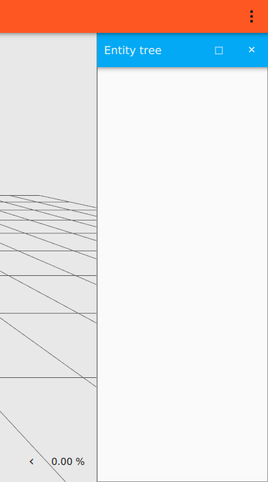
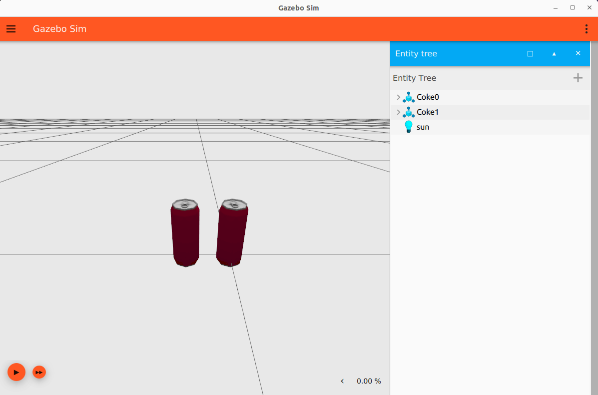

# SDF worlds

이 튜토리얼에서는 SDF를 사용하여 월드를 구축하고 모델을 추가하는 방법을 배웁니다. 텍스트 편집기를 열고 이 튜토리얼을 따라 코드를 추가하세요. 이 튜토리얼의 완성된 월드는 [여기](https://github.com/gazebosim/docs/blob/master/harmonic/tutorials/sdf_worlds/world_demo.sdf)에서 다운로드할 수도 있습니다.

## Defining a world

모든 SDF 월드는 이 태그들로 시작합니다.

```xml
<?xml version="1.0" ?>
<sdf version="1.8">
    <world name="world_demo">
    ...
    ...
    </world>
</sdf>
```

첫 두 태그는 `XML`과 `SDF`의 버전을 정의합니다. 그런 다음 모든 것이 들어가는 `<world> </world>` 태그가 있습니다.

## Physics

```xml
<physics name="1ms" type="ignored">
    <max_step_size>0.001</max_step_size>
    <real_time_factor>1.0</real_time_factor>
</physics>
```

physics 태그는 동적 엔진의 유형과 속성을 지정합니다. 스텝 크기가 1밀리초이므로 `name`을 `1ms`로 선택했습니다. `type`은 동적 엔진(물리 라이브러리)의 유형입니다. Ode, Bullet, Simbody, Dart와 같은 옵션이 있습니다. 물리 엔진 유형 선택은 아직 이 태그를 통해 수행되지 않으므로 `ignored`로 설정했습니다.

`<max_step_size>`는 시뮬레이션의 모든 시스템이 월드 상태와 상호 작용할 수 있는 최대 시간입니다. 값이 작을수록 계산이 더 정확하지만 더 많은 계산 능력이 필요합니다.
`<real_time_factor>`는 시뮬레이션 시간 대 실제 시간의 비율입니다.

## Plugins

플러그인은 동적으로 로드되는 코드 덩어리입니다. 예를 들어:

```xml
<plugin
    filename="gz-sim-physics-system"
    name="gz::sim::systems::Physics">
</plugin>
```

`Physics` 플러그인은 월드의 동역학을 시뮬레이션하는 데 매우 중요합니다.

```xml
<plugin
    filename="gz-sim-user-commands-system"
    name="gz::sim::systems::UserCommands">
</plugin>
```

`UserCommands` 플러그인은 모델 생성, 모델 이동, 삭제 및 기타 여러 사용자 명령을 담당합니다.

```xml
<plugin
    filename="gz-sim-scene-broadcaster-system"
    name="gz::sim::systems::SceneBroadcaster">
</plugin>
```

`SceneBroadcaster`는 월드 장면을 보여줍니다.

## GUI

이제 GUI를 정의해 봅시다. `<gui>` 태그 아래에 Gazebo의 `GUI`와 관련된 모든 것을 지정합니다.

```xml
<gui fullscreen="0">
    ...
    ...
</gui>
```

[gazebo-gui](https://github.com/gazebosim/gz-gui/)에는 선택할 수 있는 다양한 플러그인이 있습니다. 기본적인 기능을 갖춘 월드를 실행하는 데 필요한 플러그인을 추가하겠습니다.

```xml
<!-- 3D scene -->
<plugin filename="MinimalScene" name="3D View">
  <gz-gui>
    <title>3D View</title>
    <property type="bool" key="showTitleBar">false</property>
    <property type="string" key="state">docked</property>
  </gz-gui>

  <engine>ogre2</engine>
  <scene>scene</scene>
  <ambient_light>0.4 0.4 0.4</ambient_light>
  <background_color>0.8 0.8 0.8</background_color>
  <camera_pose>-6 0 6 0 0.5 0</camera_pose>
  <camera_clip>
    <near>0.25</near>
    <far>25000</far>
  </camera_clip>
</plugin>
<plugin filename="GzSceneManager" name="Scene Manager">
  <gz-gui>
    <property key="resizable" type="bool">false</property>
    <property key="width" type="double">5</property>
    <property key="height" type="double">5</property>
    <property key="state" type="string">floating</property>
    <property key="showTitleBar" type="bool">false</property>
  </gz-gui>
</plugin>
```

`MinimalScene`과 `GzSceneManager`는 월드의 3D 장면을 표시하는 역할을 합니다.
다음과 같은 속성을 가집니다 (대부분의 GUI 플러그인이 가지고 있습니다):

* `showTitleBar`가 true이면 `<title>` 태그에 언급된 이름으로 플러그인 위에 파란색 제목 표시줄이 표시됩니다.
* `state`는 플러그인의 상태이며 `docked`를 사용하여 제자리에 고정하거나 `floating` 상태일 수 있습니다.

렌더링 엔진으로 `ogre` 또는 `ogre2`를 선택할 수 있습니다. `<ambient_light>`와 `<background_color>`는 장면의 주변광과 배경색을 지정합니다. `<camera_pose>`는 카메라의 `X Y Z` 위치와 `Roll Pitch Yaw` 회전을 지정합니다.

### World control plugin

```xml
<!-- World control -->
<plugin filename="WorldControl" name="World control">
    <gz-gui>
        <title>World control</title>
        <property type="bool" key="showTitleBar">false</property>
        <property type="bool" key="resizable">false</property>
        <property type="double" key="height">72</property>
        <property type="double" key="width">121</property>
        <property type="double" key="z">1</property>

        <property type="string" key="state">floating</property>
        <anchors target="3D View">
        <line own="left" target="left"/>
        <line own="bottom" target="bottom"/>
        </anchors>
    </gz-gui>

    <play_pause>true</play_pause>
    <step>true</step>
    <start_paused>true</start_paused>
    <service>/world/world_demo/control</service>
    <stats_topic>/world/world_demo/stats</stats_topic>
</plugin>
```

`World control` 플러그인은 월드를 제어하는 역할을 합니다. 일부 속성은 다음과 같습니다:

* `<play_pause>`가 `true`이면 왼쪽 하단 모서리에 재생-일시 중지 버튼이 있습니다.
* `<stats_topic>` 태그는 시뮬레이션 시간 및 실제 시간과 같은 월드 통계가 게시되는 토픽을 지정합니다.
* `<start_paused>`가 `true`이면 Gazebo 시작 시 시뮬레이션이 일시 중지됩니다.

### World stats plugin

```xml
<!-- World statistics -->
<plugin filename="WorldStats" name="World stats">
    <gz-gui>
        <title>World stats</title>
        <property type="bool" key="showTitleBar">false</property>
        <property type="bool" key="resizable">false</property>
        <property type="double" key="height">110</property>
        <property type="double" key="width">290</property>
        <property type="double" key="z">1</property>

        <property type="string" key="state">floating</property>
        <anchors target="3D View">
        <line own="right" target="right"/>
        <line own="bottom" target="bottom"/>
        </anchors>
    </gz-gui>

    <sim_time>true</sim_time>
    <real_time>true</real_time>
    <real_time_factor>true</real_time_factor>
    <iterations>true</iterations>
    <topic>/world/world_demo/stats</topic>

</plugin>
```

`World stats` 플러그인은 월드 통계, 즉 `<sim_time>`, `<real_time>`, `<real_time_factor>` 및 `<iterations>`를 표시하는 역할을 합니다.

이 태그를 사용하여 표시할 값을 선택할 수 있습니다 (이 값을 보려면 오른쪽 하단 모서리를 확장하세요). 이러한 값이 게시될 `<topic>`을 선택할 수 있습니다. 월드를 실행하고 해당 토픽을 수신해 봅시다.

월드 실행:

`gz sim world_demo.sdf`

재생 버튼을 누르고 다른 터미널에서 메시지를 수신합니다:

`gz topic -e -t /world/world_demo/stats`

메시지는 다음과 같아야 합니다:


### Entity tree

```xml
<!-- Entity tree -->
<plugin filename="EntityTree" name="Entity tree">
</plugin>
```

이 플러그인에서는 월드의 모든 엔티티(시뮬레이션의 모든 것은 "엔티티"로 간주됨)를 볼 수 있습니다. 다양한 모델, 태양, 그리고 그들의 링크, 시각적 요소, 충돌 요소를 볼 수 있습니다.



아직 월드에 아무것도 추가하지 않았기 때문에 비어 있습니다.

`Transform control` 플러그인과 같이 월드의 다양한 구성 요소를 조작하고 엔티티를 이동하고 회전할 수 있는 유용한 gz-gui 플러그인이 많이 있습니다. 모델 조작 방법을 설명하는 이 [튜토리얼](manipulating_models)을 확인하세요.

플러그인은 Gazebo의 오른쪽 상단 모서리에 있는 플러그인 드롭다운 메뉴를 사용하여 GUI에서 추가할 수도 있습니다. 이제 GUI 작업이 끝났으니 월드에 다양한 요소를 추가해 봅시다. 닫는 태그 `</gui>`를 추가하는 것을 **잊지 마세요**.

## Light

```xml
<light type="directional" name="sun">
    <cast_shadows>true</cast_shadows>
    <pose>0 0 10 0 0 0</pose>
    <diffuse>0.8 0.8 0.8 1</diffuse>
    <specular>0.2 0.2 0.2 1</specular>
    <attenuation>
        <range>1000</range>
        <constant>0.9</constant>
        <linear>0.01</linear>
        <quadratic>0.001</quadratic>
    </attenuation>
    <direction>-0.5 0.1 -0.9</direction>
</light>
```

* `<light>`는 월드의 광원을 지정합니다. 빛의 `<type>`은 `point`, `directional` 또는 `spot`일 수 있습니다.
* `<pose>`는 `relative_to attribute`에 언급된 프레임에 대한 빛 요소의 위치(x,y,z)와 방향(roll, pitch, yaw)입니다. 우리의 경우 (`relative_to` 속성이 무시됨) 월드에 상대적입니다.
* `<cast_shadows>`가 true이면 빛이 그림자를 드리웁니다. `<diffuse>`와 `<specular>`는 확산광과 반사광 색상입니다.
* `<attenuation>`은 빛 감쇠 속성을 지정하며, 이는 다음과 같습니다:

  * `<range>`는 빛의 범위입니다.
  * `<constant>`는 상수 감쇠 계수이며, `1`은 감쇠하지 않음을 의미하고 `0`은 완전 감쇠를 의미합니다.
  * `<linear>`는 선형 감쇠 계수이며, `1`은 거리에 따라 균일하게 감쇠함을 의미합니다.
  * `<quadratic>`는 이차 감쇠 계수입니다. 감쇠에 곡률을 추가합니다.
  * `<direction>`은 빛의 방향이며, 스포트라이트와 방향성 빛에만 적용됩니다.

## Adding models

자체 모델을 만드는 대신 이미 만들어진 모델을 사용할 수 있습니다. [Gazebo Fuel](https://app.gazebosim.org/fuel)은 Gazebo 월드에 쉽게 추가할 수 있는 수백 개의 모델을 호스팅합니다. 모델은 다음과 같이 추가할 수 있습니다.

### Spawning a model

Fuel에서 다양한 모델을 월드에 추가하려면 이 [튜토리얼](fuel_insert)을 확인하세요.

### Include the model URI

모델을 월드에 추가하는 또 다른 방법은 모델 링크를 사용하는 것입니다. [Gazebo Fuel website](https://app.gazebosim.org/fuel)를 방문하세요. 원하는 모델을 선택하고 모델 설명 페이지에서 `<>` 아이콘을 클릭하세요. 이렇게 하면 SDF 스니펫이 클립보드에 복사됩니다. 그런 다음 닫는 `</world>` 태그 바로 위에 월드에 붙여넣으세요. 다음과 같습니다:

```xml
<include>
    <uri>
    https://fuel.gazebosim.org/1.0/OpenRobotics/models/Coke
    </uri>
</include>
```

### Download the model

이전 방법은 런타임에 모델을 다운로드합니다. 모델을 영구적으로 저장하려면 Fuel에서 모델을 다운로드한 다음 다음과 같이 참조할 수 있습니다:

```xml
<include>
    <uri>
    model://Coke
    </uri>
</include>
```

`GZ_SIM_RESOURCE_PATH` 환경 변수를 모델의 상위 폴더로 설정해야 합니다. 예를 들어 디렉토리가 다음과 같으면:

```
world_tutorial<br/>
├── Coke <br/>
└── world_demo.sdf
```

다음과 같이 `world_tutorial` 디렉토리로 설정해야 합니다:

`export GZ_SIM_RESOURCE_PATH="$HOME/world_tutorial"`

월드 실행:

`gz sim world_demo.sdf`

월드의 원점에 모델이 표시되어야 합니다.


`<pose>` 태그를 사용하여 좌표를 설정할 수도 있습니다.
동일한 모델의 여러 인스턴스를 스폰하려면 `<name>` 태그를 사용하여 다른 이름을 지정해야 합니다.

```
    <include>
        <name>Coke0</name>
        <pose>0 0 0 0 0 0</pose>
        <uri>https://fuel.gazebosim.org/1.0/OpenRobotics/models/Coke</uri>
    </include>
    <include>
        <name>Coke1</name>
        <pose>0 0.1 0 0 0 0</pose>
        <uri>https://fuel.gazebosim.org/1.0/OpenRobotics/models/Coke</uri>
    </include>
```


이제 사용자 지정 월드가 있으므로 [다음 튜토리얼](sensors)에서는 로봇이 주변 월드와 상호 작용할 수 있도록 센서를 추가하는 방법을 배웁니다.

## Video walk-through

이 튜토리얼의 비디오 연습은 YouTube 채널에서 볼 수 있습니다: [Gazebo tutorials: Creating worlds](https://youtu.be/48TX-XJ14Gs).

<iframe width="560" height="315" src="https://www.youtube.com/embed/48TX-XJ14Gs" frameborder="0" allow="accelerometer; autoplay; encrypted-media; gyroscope; picture-in-picture" allowfullscreen></iframe>