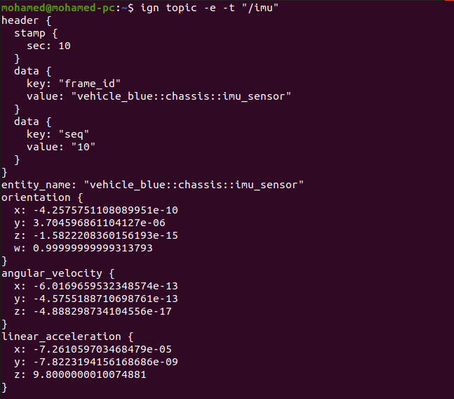
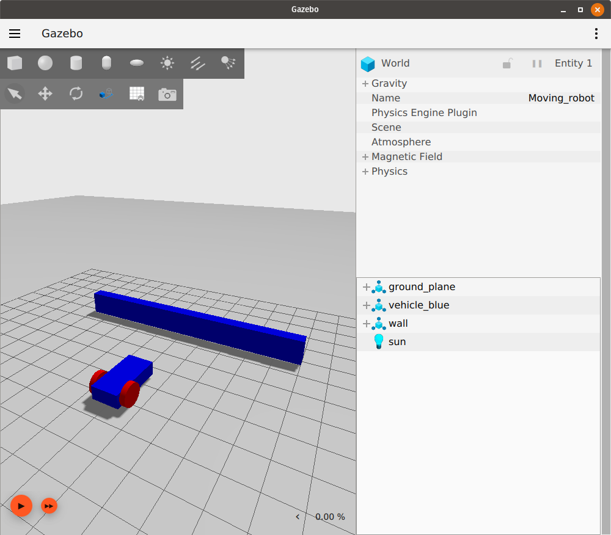

# Sensors

**참고:** 이 튜토리얼은 [Moving the robot tutorial](moving_robot)의 연속입니다.

이 튜토리얼에서는 로봇 및 월드의 다른 모델에 센서를 추가하는 방법을 배웁니다. IMU 센서, 접촉 센서, Lidar 센서의 세 가지 다른 센서를 사용합니다. 또한 `gz launch`를 사용하여 단일 파일로 여러 작업을 시작하는 방법도 배웁니다.

이러한 모든 플러그인이 사용되는 이 튜토리얼의 최종 월드는 [here](https://github.com/gazebosim/docs/blob/master/harmonic/tutorials/sensors/sensor_tutorial.sdf)에서 찾을 수 있습니다.
또한 개별 예제에 대해 가능한 많은 센서 및 작동 기능을 갖춘 광범위한 월드 예제 세트를 [`gz-sim/examples/worlds`](https://github.com/gazebosim/gz-sim/tree/gz-sim8/examples/worlds)에서 찾을 수 있습니다.
전체 센서 세트는 [`gz-sensors` library](https://github.com/gazebosim/gz-sensors)에서 찾을 수 있습니다.
ROS를 사용하는 경우 이러한 예제에 대한 데모 실행 및 브리징 구성은 [here](https://github.com/gazebosim/ros_gz/tree/jazzy/ros_gz_sim_demos/launch)에서 볼 수 있습니다.

## Preliminaries

현재 플러그인이 포함되지 않은 SDF 파일에 `plugin`을 추가할 때 기본 플러그인은 로드되지 않습니다. 센서를 추가하기 전에 GZ GUI를 계속 사용할 수 있도록 월드에 몇 가지 논리적 기본값을 추가해야 합니다.

```xml
<sdf version='1.9'>
  <world name='demo'>
    <plugin
        filename="gz-sim-physics-system"
        name="gz::sim::systems::Physics">
    </plugin>
    <plugin
        filename="gz-sim-scene-broadcaster-system"
        name="gz::sim::systems::SceneBroadcaster">
    </plugin>

    <!-- ... -->
```

## IMU sensor

관성 측정 장치(IMU)는 로봇의 `orientation`을 쿼터니언으로, 세 축(X, Y, Z)의 `angular_velocity`를, 세 축의 `linear_acceleration`을 출력합니다. 우리의 [moving_robot.sdf](https://github.com/gazebosim/docs/blob/master/harmonic/tutorials/moving_robot/moving_robot.sdf) 월드를 사용하고 수정해 보겠습니다. 새 파일 `sensor_tutorial.sdf`를 만들고 `moving_robot.sdf`의 코드를 추가합니다.
`IMU` 센서를 정의하려면 `<world>` 태그 아래에 이 코드를 추가합니다.

```xml
<plugin filename="gz-sim-imu-system"
        name="gz::sim::systems::Imu">
</plugin>
```

이 코드는 우리 월드에서 사용할 `IMU` 센서 플러그인을 정의합니다.
이제 다음과 같이 로봇에 `IMU` 센서를 추가할 수 있습니다.

```xml
<sensor name="imu_sensor" type="imu">
    <always_on>1</always_on>
    <update_rate>1</update_rate>
    <visualize>true</visualize>
    <topic>imu</topic>
</sensor>
```

센서는 일반적으로 모델의 링크 중 하나에 추가됩니다. 우리는 `chassis` 링크 아래에 추가했습니다.

태그를 설명해 보겠습니다.

 * `<always_on>` 참이면 센서가 업데이트 속도에 따라 항상 업데이트됩니다.
 * `<update_rate>` 센서 데이터가 생성되는 빈도입니다.
 * `<visualize>` 참이면 센서가 GUI에 시각화됩니다.
 * `<topic>` 데이터가 게시되는 토픽의 이름입니다.
 * `<mean>` 평균값 (보통 0, 센서 노이즈의 중심)
 * `<stddev>` 표준편차 (센서 랜덤 노이즈 크기)
 * `<bias_mean>` 바이어스 평균 (센서에 항상 존재하는 고정 오차)
 * `<biad_stddev>` 바이어스의 표준편차 (시간마다 바이어스가 달라질 수 있는 정도)
 * `<dynamic_bias_stddev>` 시간에 따라 변화하는 바이어스의 표준편차
 * `<dynamic_bias_correlation_time>` 동적 바이어스의 시간 상관관계, 클수록 변화가 느림
 * `<precision>` 최소 분해능, 가장 작은 감지 가능한 단위
  

**참고:** 아직 모든 센서에 대해 모든 태그가 지원되는 것은 아닙니다.

### Read data from IMU

`IMU`에서 데이터를 읽으려면 한 터미널에서 월드를 실행하고 재생 버튼을 누릅니다.

`gz sim sensor_tutorial.sdf`

다른 터미널에서 다음을 실행합니다.

`gz topic -e -t /imu`

마지막 명령은 `/imu` 토픽을 통해 전송되는 메시지를 수신합니다. IMU 데이터는 위에서 설명한 대로 `orientation`, `angular_velocity` 및 `linear_acceleration`입니다. 다음과 같이 보여야 합니다.



키보드 위쪽 화살표 키를 사용하여 로봇을 앞으로 이동합니다. 센서 값이 변경되는 것을 볼 수 있습니다.

## Contact sensor

다른 유형의 센서인 `contact` 센서를 소개해 보겠습니다.
이름에서 알 수 있듯이 이 센서는 다른 물체와 접촉(접촉)할 때 표시를 제공합니다. 장애물(벽)을 만들고 여기에 접촉 센서를 추가합니다. 로봇이 장애물에 부딪히면 멈춰서 로봇이 손상되는 것을 방지합니다. 먼저 다음과 같이 장애물을 만듭니다.

```xml
<model name='wall'>
    <static>true</static>
    <pose>5 0 0 0 0 0</pose><!--pose relative to the world-->
    <link name='box'>
        <visual name='visual'>
            <geometry>
                <box>
                    <size>0.5 10.0 2.0</size>
                </box>
            </geometry>
            <!--let's add color to our link-->
            <material>
                <ambient>0.0 0.0 1.0 1</ambient>
                <diffuse>0.0 0.0 1.0 1</diffuse>
                <specular>0.0 0.0 1.0 1</specular>
            </material>
        </visual>
        <collision name='collision'>
            <geometry>
                <box>
                    <size>0.5 10.0 2.0</size>
                </box>
            </geometry>
        </collision>
    </link>
</model>
```

상자 모양의 링크가 하나 있는 간단한 모델입니다. 모델을 만드는 방법은 [Build your own robot tutorial](building_robot)에서 확인할 수 있습니다.

이제 월드를 실행하고 시뮬레이션에서 벽이 다음과 같이 나타나는지 확인합니다.



벽에 접촉 센서를 추가해 보겠습니다. `IMU` 센서와 마찬가지로 먼저 다음 코드를 추가하여 `Contact` 센서를 정의해야 합니다.

```xml
<plugin filename="gz-sim-contact-system"
        name="gz::sim::systems::Contact">
</plugin>
```

이제 `wall` 모델의 `box` 링크에 `contact` 센서를 추가할 수 있습니다.

```xml
<sensor name='sensor_contact' type='contact'>
    <contact>
        <collision>collision</collision>
    </contact>
</sensor>
```

`<sensor>`의 정의는 간단하며 센서의 `name`과 `type`만 정의합니다. 그리고 `collision` 내부에는 `collision`인 상자 링크 충돌 이름을 정의합니다.

다음과 같이 `wall` 모델 아래에 `TouchPlugin`도 추가해야 합니다.

```xml
<plugin filename="gz-sim-touchplugin-system"
        name="gz::sim::systems::TouchPlugin">
    <target>vehicle_blue</target>
    <namespace>wall</namespace>
    <time>0.001</time>
    <enabled>true</enabled>
</plugin>
```

`TouchPlugin`은 `wall`이 터치되면 메시지를 게시(전송)합니다. 플러그인의 태그는 다음과 같습니다.

* `<target>` 우리 벽과 접촉할 대상, 이 경우 `vehicle_blue`입니다.
* `<namespace>` 토픽의 네임스페이스를 사용하므로 로봇이 벽에 부딪히면 `/wall/touched` 토픽으로 메시지를 보냅니다.

한 터미널에서 월드를 실행합니다.

`gz sim sensor_tutorial.sdf`

다른 터미널에서 `/wall/touched` 토픽을 수신합니다.

`gz topic -e -t /wall/touched`

키보드 화살표 키를 사용하여 로봇을 벽 쪽으로 운전합니다. 재생 버튼을 눌러 시뮬레이션을 시작하고 플러그인 드롭다운 목록(세로 줄임표)을 클릭한 다음 "Key Publisher"를 선택하여 Key Publisher 플러그인도 활성화해야 합니다.

범프에 부딪히면 `gz topic -e -t /wall/touched`를 실행한 터미널에 `data: true` 메시지가 표시되어야 합니다.

이제 `TriggeredPublisher` 플러그인을 사용하여 로봇이 벽에 부딪힐 때 멈추도록 다음과 같이 할 수 있습니다.

```xml
<plugin filename="gz-sim-triggered-publisher-system"
        name="gz::sim::systems::TriggeredPublisher">
    <input type="gz.msgs.Boolean" topic="/wall/touched">
        <match>data: true</match>
    </input>
    <output type="gz.msgs.Twist" topic="/cmd_vel">
        linear: {x: 0.0}, angular: {z: 0.0}
    </output>
</plugin>
```

[Moving robot tutorial](moving_robot)에서 설명했듯이 수신된 입력에 따라 출력을 게시할 수 있습니다. 따라서 `/wall/touched` 토픽에서 `data: true`를 수신하면 `linear: {x: 0.0}, angular: {z: 0.0}`을 게시하여 로봇을 멈춥니다.

## Lidar sensor

로봇이 벽에 전혀 닿지 않기를 원합니다. 왜냐하면 이것은 약간의 손상을 일으킬 수 있기 때문입니다. 그래서 접촉 센서 대신 Lidar를 사용할 수 있습니다. Lidar는 "light detection and ranging"의 약자입니다. 이 센서는 로봇 주변의 장애물을 감지하는 데 도움이 될 수 있습니다. 우리는 이것을 사용하여 로봇과 벽 사이의 거리를 측정할 것입니다.

먼저 lidar를 고정할 프레임을 만듭니다. 이것은 lidar 프레임이 로봇의 `chassis`에 부착되므로 `vehicle_blue` `<model>` 태그 내부에 추가해야 합니다.

```xml
<frame name="lidar_frame" attached_to='chassis'>
    <pose>0.8 0 0.5 0 0 0</pose>
</frame>
```

그런 다음 `lidar` 센서를 사용하려면 `<world>` 태그 아래에 이 플러그인을 추가합니다.

```xml
    <plugin
      filename="gz-sim-sensors-system"
      name="gz::sim::systems::Sensors">
      <render_engine>ogre2</render_engine>
    </plugin>
```

`chassis` 링크 아래에 다음과 같이 `lidar` 센서를 추가할 수 있습니다.

```xml
<sensor name='gpu_lidar' type='gpu_lidar'>"
    <pose relative_to='lidar_frame'>0 0 0 0 0 0</pose>
    <topic>lidar</topic>
    <update_rate>10</update_rate>
    <ray>
        <scan>
            <horizontal>
                <samples>640</samples>
                <resolution>1</resolution>
                <min_angle>-1.396263</min_angle>
                <max_angle>1.396263</max_angle>
            </horizontal>
            <vertical>
                <samples>1</samples>
                <resolution>0.01</resolution>
                <min_angle>0</min_angle>
                <max_angle>0</max_angle>
            </vertical>
        </scan>
        <range>
            <min>0.08</min>
            <max>10.0</max>
            <resolution>0.01</resolution>
        </range>
    </ray>
    <always_on>1</always_on>
    <visualize>true</visualize>
</sensor>
```

*   센서의 `name`(이름)과 `type`(유형)을 정의하고, `<pose relative_to='lidar_frame'>`을 사용하여 `lidar_frame`에 상대적인 센서의 위치와 방향을 설정합니다. (참고: 예제에서는 `lidar_frame`을 사용하지만, 일반적으로 `base_link`와 같은 로봇의 기준 프레임에 상대적으로 정의합니다.)
*   `<topic>`: Lidar 데이터가 게시될 토픽의 이름입니다.
*   `<update_rate>`: 데이터 발행 주기(Hz)입니다. 예제에서는 `10Hz`로, `0.1초`마다 데이터가 생성됩니다.
*   `<ray>`: Lidar 광선과 관련된 설정을 포함하는 부모 태그입니다.
    *   `<scan>`: 스캔 패턴과 관련된 설정을 정의합니다.
        *   `<horizontal>`: 수평 스캔에 대한 설정을 정의합니다.
            *   `<samples>`: 수평 방향으로 스캔할 레이(광선)의 개수입니다.
            *   `<resolution>`: 수평 해상도 배율입니다. 일반적으로 `1`로 설정되며, 이 경우 `<samples>` 값과 동일한 수의 데이터 포인트가 생성됩니다.
            *   `<min_angle>` 및 `<max_angle>`: 수평 스캔의 시작 각도와 끝 각도 (라디안 단위)입니다. 예를 들어, 예제의 `-1.396263` rad에서 `1.396263` rad는 약 ±80도에 해당합니다.
        *   `<vertical>`: 수직 스캔에 대한 설정을 정의합니다. (2D Lidar의 경우, 수직 스캔은 단일 평면을 나타냅니다.)
            *   `<samples>`: 수직 방향으로 스캔할 레이의 개수입니다. 2D Lidar의 경우 보통 `1`입니다.
            *   `<resolution>`: 수직 해상도 배율입니다.
            *   `<min_angle>` 및 `<max_angle>`: 수직 스캔의 시작 각도와 끝 각도 (라디안 단위)입니다. 2D Lidar의 경우 보통 `0`으로 설정하여 단일 수평면을 스캔합니다.
    *   `<range>`: 각 레이의 거리 측정 능력과 관련된 설정을 정의합니다.
        *   `<min>`: 센서가 감지할 수 있는 최소 거리 (미터 단위)입니다. 이보다 가까운 물체는 감지되지 않을 수 있습니다.
        *   `<max>`: 센서가 감지할 수 있는 최대 거리 (미터 단위)입니다. 이보다 먼 물체는 감지되지 않을 수 있습니다.
        *   `<resolution>`: 거리 측정값의 분해능 (미터 단위)입니다. 센서가 구분할 수 있는 최소 거리 변화량을 의미합니다.
*   `<always_on>`: `true`로 설정하면 센서가 `<update_rate>`에 따라 항상 활성화되어 데이터를 생성합니다. `false`인 경우, 센서가 활성화되는 다른 메커니즘(예: 토픽 구독)이 필요할 수 있습니다.
*   `<visualize>`: `true`로 설정하면 시뮬레이션 GUI에서 센서의 레이가 시각적으로 표시됩니다. 디버깅에 유용합니다.
*   `<noise>` (선택 사항): 센서 데이터에 적용할 노이즈 모델을 정의합니다. 이를 통해 더 현실적인 센서 데이터를 시뮬레이션할 수 있습니다.
    *   `<type>`: 노이즈의 유형을 지정합니다 (예: `gaussian`은 가우시안 노이즈를 의미).
    *   `<mean>`: 노이즈 분포의 평균값입니다. 가우시안 노이즈의 경우 보통 `0.0`입니다.
    *   `<stddev>`: 노이즈 분포의 표준 편차입니다. 값이 클수록 노이즈의 변동성이 커집니다.
*   `<clip>` (선택 사항): 센서의 렌더링 범위를 제한합니다. 주로 시각화 성능에 영향을 줄 수 있습니다.
    *   `<near>`: 이 값(미터 단위)보다 가까운 물체는 렌더링에서 제외될 수 있습니다.
    *   `<far>`: 이 값(미터 단위)보다 먼 물체는 렌더링에서 제외될 수 있습니다.

이제 월드를 실행하고 왼쪽 하단 모서리에 있는 재생 버튼을 누릅니다.

`gz sim sensor_tutorial.sdf`

`/lidar` 토픽의 lidar 메시지, 특히 `ranges` 데이터를 확인합니다.

`gz topic -e -t /lidar`

lidar 메시지에는 다음과 같은 속성이 있습니다.

```
message LaserScan
{
  Header header              = 1;

  string frame               = 2;
  Pose world_pose            = 3;
  double angle_min           = 4;
  double angle_max           = 5;
  double angle_step          = 6;
  double range_min           = 7;
  double range_max           = 8;
  uint32 count               = 9;
  double vertical_angle_min  = 10;
  double vertical_angle_max  = 11;
  double vertical_angle_step = 12;
  uint32 vertical_count      = 13;

  repeated double ranges              = 14;
  repeated double intensities         = 15;
}
```

### Avoid the wall

이제 로봇에 lidar가 있으므로 `ranges` 데이터를 사용하여 로봇이 벽에 부딪히는 것을 피할 수 있습니다.
이를 위해 센서 데이터를 수신하고 로봇에 속도 명령을 보내는 짧은 C++ 프로그램을 작성합니다.
이 프로그램은 노드라고 합니다. `/lidar` 토픽을 구독하고 해당 데이터를 읽는 노드를 빌드합니다.
`publisher` 및 `subscriber` 노드를 빌드하는 방법을 배우려면 이 [tutorial](https://gazebosim.org/api/transport/9.0/messages.html)을 참조하십시오.
이 데모용 완성된 노드는 [here](https://github.com/gazebosim/docs/blob/master/harmonic/tutorials/sensors/lidar_node.cc)에서 다운로드할 수 있습니다.

#### The lidar_node

```cpp
std::string topic_pub = "/cmd_vel";
gz::transport::Node node;
auto pub = node.Advertise<gz::msgs::Twist>(topic_pub);
```

`cmd_vel` 토픽에 게시할 `node`를 선언합니다. 그런 다음 노드를 광고합니다.

```cpp
void cb(const gz::msgs::LaserScan &_msg)
{
  gz::msgs::Twist data;

  bool allMore = true;
  for (int i = 0; i < _msg.ranges_size(); i++)
  {
    if (_msg.ranges(i) < 1.0)
    {
      allMore = false;
      break;
    }
  }
  if (allMore) //if all bigger than one
  {
    data.mutable_linear()->set_x(0.5);
    data.mutable_angular()->set_z(0.0);
  }
  else
  {
    data.mutable_linear()->set_x(0.0);
    data.mutable_angular()->set_z(0.5);
  }
  pub.Publish(data);
}
```

콜백 함수 내에서 모든 광선의 범위가 `1.0`보다 큰지 확인합니다.
그렇다면 자동차에 메시지를 게시하여 앞으로 이동합니다. 그렇지 않으면 로봇을 회전시킵니다.

```cpp
int main(int argc, char **argv)
{
    std::string topic_sub = "/lidar";
    // Subscribe to a topic by registering a callback.
    if (!node.Subscribe(topic_sub, cb))
    {
        std::cerr << "Error subscribing to topic [" << topic_sub << "]" << std::endl;
        return -1;
    }

    // Zzzzzz.
    gz::transport::waitForShutdown();

    return 0;
}
```

main 내부에서 `lidar` 토픽을 구독하고 노드가 종료될 때까지 기다립니다.

#### Build the node

[CMakeLists.txt](https://github.com/gazebosim/docs/blob/master/harmonic/tutorials/sensors/CMakeLists.txt)를 다운로드하고 `lidar_node`와 동일한 폴더에 `build/` 디렉토리를 만듭니다.

```sh
mkdir build
cd build
```

cmake를 실행하고 코드를 빌드합니다.

```sh
cmake ..
make lidar_node
```

##### Run the node

터미널 1에서 노드를 실행합니다.

```sh
./build/lidar_node
```

터미널 2에서 월드를 실행합니다.

```sh
gz sim sensor_tutorial.sdf
```

이제 로봇이 앞으로 움직이고 벽에 접근하면 왼쪽으로 회전하기 시작하여 장애물이 없어지면 다시 앞으로 움직이는 것을 볼 수 있습니다(로봇이 움직이기 시작하도록 왼쪽 하단 모서리에 있는 재생 버튼을 눌러야 합니다).

## Gazebo launch

두 개의 다른 터미널에서 두 개의 다른 작업을 실행하는 대신 `sensor_world`와 `lidar_node`를 동시에 실행하는 launch 파일을 만들 수 있습니다. 텍스트 편집기를 열고 다음 코드를 추가합니다.

```xml
<?xml version='1.0'?>
<gz version='1.0'>
  <executable name='sensor-world'>
    <command>gz sim sensor_tutorial.sdf</command>
  </executable>

  <executable name='lidar_node'>
    <command>./build/lidar_node</command>
  </executable>

</gz>
```

launch 파일은 XML 파일입니다. `<executable>` 태그 아래에서 실행될 명령을 간단히 정의합니다.
첫 번째 명령은 월드를 시작하는 `gz sim sensor_tutorial.sdf`입니다.
그리고 두 번째 명령은 `lidar_node`를 실행하는 `./build/lidar_node`입니다.
파일을 `sensor_launch.gzlaunch`로 저장한 다음 다음 명령을 사용하여 실행합니다.

```sh
gz launch sensor_launch.gzlaunch
```

시뮬레이션을 시작하려면 재생 버튼을 누릅니다. 만세! 이제 로봇이 움직이고 벽을 피하고 있습니다.

시뮬레이션에 복잡성을 더 추가하려면 [next tutorial](actors)에서 월드에 액터를 추가하는 방법을 배우십시오.

## Video walk-through

이 튜토리얼의 비디오 연습은 YouTube 채널에서 제공됩니다: [Gazebo tutorials: Sensors](https://youtu.be/WcFyGPEfhHc)

<iframe width="560" height="315" src="https://www.youtube.com/embed/WcFyGPEfhHc" frameborder="0" allow="accelerometer; autoplay; encrypted-media; gyroscope; picture-in-picture" allowfullscreen></iframe>