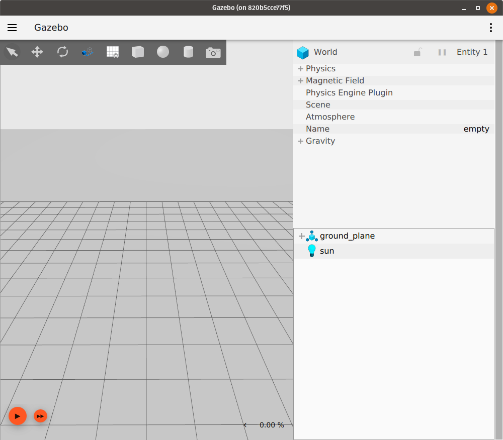

# Spawn URDF

이 튜토리얼에서는 Gazebo Sim에서 URDF 모델을 생성하는 방법을 다룹니다.
URDF 파일은 종종 ROS에서 로봇 모델을 나타내는 데 사용됩니다.
SDF는 여러 로봇 모델이 있는 월드를 설명할 수 있지만, URDF는 하나의 로봇 모델만 설명할 수 있습니다.
URDF에 대한 자세한 정보는 [https://wiki.ros.org/urdf](https://wiki.ros.org/urdf)에서 찾을 수 있습니다.

## Obtaining a URDF file

이 튜토리얼은 독자가 이미 Gazebo Sim에 로드하려는 URDF 파일을 가지고 있다고 가정합니다.
사용할 URDF 파일을 찾고 있다면, 미리 처리된 [`rrbot.urdf`](https://github.com/gazebosim/docs/blob/master/harmonic/tutorials/spawn_urdf/rrbot.urdf)를 사용할 수 있습니다. `rrbot` 로봇 모델은 [`gazebo_ros_demos`](https://github.com/ros-simulation/gazebo_ros_demos) 패키지에서 가져온 것입니다. [https://wiki.ros.org/urdf/Examples](https://wiki.ros.org/urdf/Examples)에 나열된 예제 중 하나를 사용할 수도 있습니다.

로봇 모델의 `xacro` 표현이 있는 경우, [`xacro`](https://index.ros.org/p/xacro/) 패키지를 사용하여 `xacro` 파일을 `URDF` 파일로 변환할 수 있습니다: 자세한 내용은 [this tutorial](https://docs.ros.org/en/humble/Tutorials/Intermediate/URDF/Using-Xacro-to-Clean-Up-a-URDF-File.html)을 참조하십시오.

## Spawning the URDF

Gazebo Sim에서 URDF 모델을 생성하기 위해 월드를 시작하고 월드의 `create` 서비스를 사용합니다. 이 서비스는 [EntityFactory](https://gazebosim.org/api/msgs/9/entity__factory_8pb_8h.html) 메시지 유형을 사용합니다.

Gazebo Sim에서 빈 월드를 시작합니다:
```bash
gz sim empty.sdf
```

다음과 같은 창이 나타납니다:



다른 터미널에서 `gz service -l`을 실행하여 사용 가능한 서비스 목록을 가져옵니다.
`create` 서비스를 찾습니다.
목록에서 이 서비스를 볼 수 있습니다:
```
/world/empty/create
```

`gz service -is /world/empty/create`를 실행하여 이 서비스가 우리가 사용하려는 서비스인지 다시 확인할 수 있습니다.
그러면 서비스의 요청 및 응답 메시지 유형이 표시됩니다:
```
gz.msgs.EntityFactory, gz.msgs.Boolean
```

이제 `EntityFactory` 요청 유형을 가진 서비스를 찾았으므로, 이 서비스를 호출하고 URDF 파일을 서비스의 요청에 전달하여 이 URDF 파일로 표현되는 로봇이 Gazebo Sim 월드에 생성되도록 할 수 있습니다.
이를 위해 `EntityFactory` 요청 메시지의 `sdf_file_name` 필드에 원하는 URDF 파일을 설정합니다.
그러면 [libsdformat](https://gazebosim.org/libs/sdformat) 라이브러리가 내부적으로 URDF 파일을 SDF 표현으로 변환하고 실행 중인 월드에 로드합니다.

다음 명령은 URDF 파일 `model.urdf`를 `urdf_model`이라는 이름의 모델로 Gazebo Sim 월드에 생성합니다:
```bash
gz service -s /world/empty/create --reqtype gz.msgs.EntityFactory --reptype gz.msgs.Boolean --timeout 1000 --req 'sdf_filename: "/path/to/model.urdf", name: "urdf_model"'
```

`model.urdf`가 `gazebo_ros_demos` 패키지의 [rrbot.xacro](https://github.com/ros-simulation/gazebo_ros_demos/blob/kinetic-devel/rrbot_description/urdf/rrbot.xacro)의 URDF 표현인 경우, 위의 서비스 호출을 실행하면 시뮬레이션이 이제 다음과 같이 보입니다:


이제 시뮬레이션을 재생하여 로드된 URDF 모델이 예상대로 작동하는지 확인할 수 있습니다:

